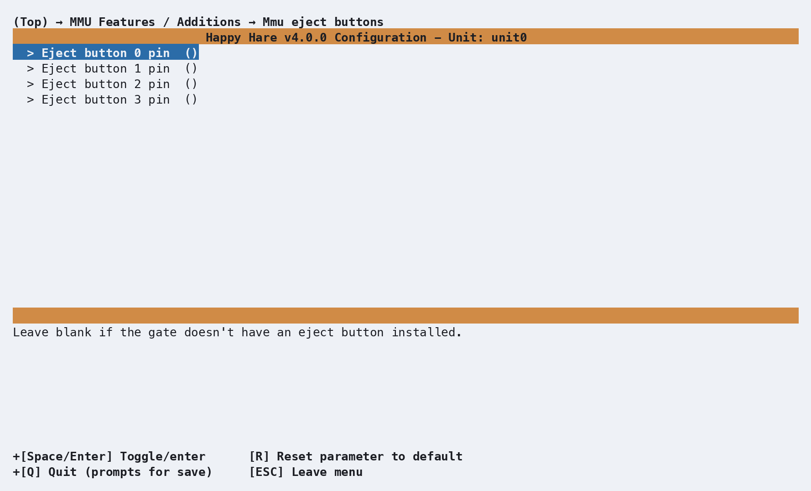

# Feature: Eject Buttons

## Concept

Some designs (QuattroBox, for example) fit a physical button per gate that
ejects that gate's filament directly, no console/UI interaction needed.
Enable under **MMU Features / Additions**:

<p align="center">
  
</p>

Each configured pin produces a `[gcode_button ...]` in `mmu_hardware.cfg`
that calls [`MMU_EJECT`](Reference-Commands.md#mmu_eject) for that specific
gate:

```ini
[gcode_button unit0_eject0]
pin: ^unit0_gate0:PB2
press_gcode:
    MMU_EJECT UNIT=unit0 LGATE=0
```

`LGATE=` (local gate index) is exactly what a physical per-gate button
needs and isn't something you'd normally type by hand on the console -
`MMU_EJECT GATE=<n>` (the global gate number) is the everyday form for
manual use.

!!! warning "Important"
    Pin polarity depends on your button's wiring, not just its pin number.
    Most eject buttons are normally-closed switches and want a plain
    pull-up pin (`^unit0_gate0:PB2`). Normally-open momentary buttons (like
    the EMU LED Button Board) need an **inverted** pin instead
    (`^!unit0_gate0:PB2`) - get this backwards and Klipper can see the
    button as already pressed right after a restart, ejecting filament on
    its own.

## Troubleshooting

- **A gate ejects on its own after a restart** - the eject button's pin
  polarity doesn't match how it's wired; see the warning above.

## See also

- [Command Reference: `MMU_EJECT`](Reference-Commands.md#mmu_eject)

---
