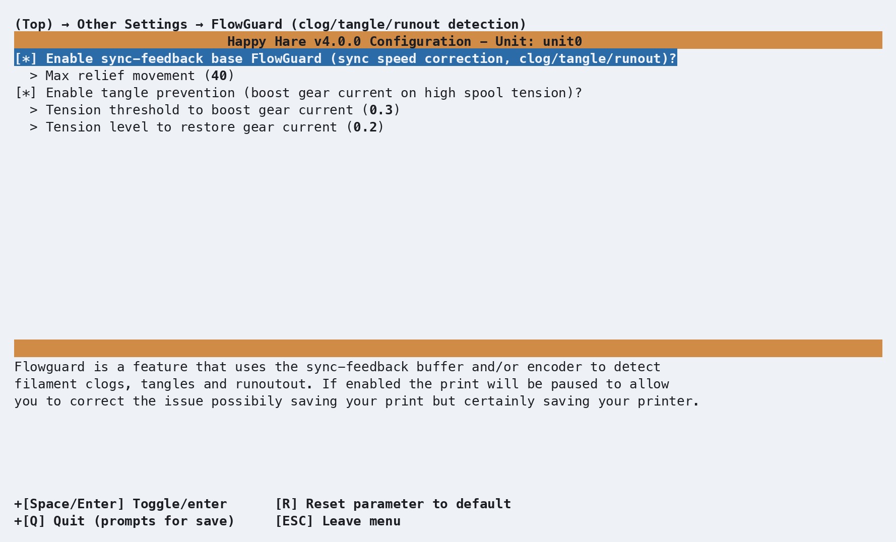

# Feature: FlowGuard

## Concept

FlowGuard is the layer that turns raw sensor movement (or its absence) into
a clog, tangle, or runout decision. It doesn't have hardware of its own -
it activates automatically once a unit has a [sync-feedback
buffer](Feature-Sync-Feedback-Buffer.md), an [encoder](Feature-Encoder.md),
or both, and combines whichever of the two is fitted:

- **Sync-feedback buffer.** Happy Hare tracks how far the buffer has moved
  from neutral since the last reset - a **relief movement**. Drifting too
  far towards compression signals a clog (something's blocking the filament
  from advancing); too far towards tension signals a tangle (something's
  resisting it from behind, at the spool). A proportional sensor also
  enables **tangle prevention** - boosting the gear stepper's current
  automatically while tension is high, to help pull through minor spool
  resistance before it becomes a genuine tangle.
- **Encoder.** With no encoder movement seen over some amount of extruder
  travel, FlowGuard raises a clog/tangle event too - it just can't tell
  which of the two it is this way, unlike the buffer's directional signal.

Either source feeds the same
[runout/clog-vs-tangle decision logic](Feature-Endless-Spool-Runout.md#concept)
already covered on the EndlessSpool & Runout Detection page - FlowGuard is
what *detects* the event; what happens next (a pause, or a genuine runout
handled by EndlessSpool) is the same either way, whether the trigger came
from a switch sensor, the encoder, or the buffer.

## Hardware Setup

No hardware of its own - FlowGuard's own menu only appears once a
sync-feedback buffer and/or encoder is configured. See [Feature:
Sync-Feedback Buffer](Feature-Sync-Feedback-Buffer.md) and [Feature:
Encoder](Feature-Encoder.md) for wiring either sensor.

<p align="center">
  
</p>

## Parameter Setup

```yaml
flowguard_enabled            : 1     # 0 = FlowGuard disabled entirely, 1 = enabled

# Sync-feedback buffer detection (only shown with a buffer fitted)
flowguard_max_relief         : 40    # mm of relief movement tolerated before triggering a clog/tangle

# Tangle prevention (only shown with a buffer fitted - needs a proportional sensor to actually do anything)
tangle_prevention_enabled    : 1     # 0 = disabled, 1 = enabled
tangle_prevention_threshold  : 0.3   # Tension level (0.2-0.9) that boosts gear current to 100%
tangle_prevention_release    : 0.2   # Tension level (0.15-0.8) that restores normal current - must be below threshold

# Encoder detection (only shown with an encoder fitted)
flowguard_encoder_mode       : 2     # 0 = off, 1 = static detection length, 2 = autotuned detection length
flowguard_encoder_max_motion : 20.0  # mm - only used in mode 1 (static); mode 2 tunes this itself and persists it in mmu_vars.cfg
```

A smaller `flowguard_max_relief` triggers sooner - start high and reduce it
if you want more sensitivity, since how much relief movement is normal
depends heavily on filament "spring" in the bowden tube, friction, and your
buffer's own `sync_feedback_buffer_range`. Proportional sensors can
generally run a lower value than switch sensors.

`tangle_prevention_threshold`/`_release` are both shown regardless of
sensor type, but only take effect with a proportional sensor fitted - the
gap between the two thresholds is deliberate hysteresis, so the current
boost doesn't thrash on and off right at the trigger point.

!!! tip
    As with most `mmu_parameters`, every setting here can be changed live
    with `MMU_TEST_CONFIG <var>=<value>` - no Klipper restart needed.

## Commands

```yaml
MMU_FLOWGUARD                    # Status report
MMU_FLOWGUARD ENABLE=0           # Disable on the active unit
MMU_FLOWGUARD ENABLE=1 UNIT=ALL  # Enable on every unit
```

Full parameter reference: [`MMU_FLOWGUARD`](Command-Reference.md#mmu_flowguard).

```text
> MMU_FLOWGUARD
FlowGuard monitoring feature is enabled and currently active on unit0
```

or, disabled:

```text
> MMU_FLOWGUARD
FlowGuard monitoring feature is disabled on unit0
```

Trying to enable it on a unit with neither a buffer nor an encoder fitted
warns instead: "FlowGuard requires sync feedback enabled on buffer or
encoder to function."

## Printer variables exposed

See [`flowguard`](Printer-Variables.md#sync-feedback-flowguard-and-tangle-prevention)
and [`tangle_prevention`](Printer-Variables.md#sync-feedback-flowguard-and-tangle-prevention)
in the printer variable reference - both are dicts, present whenever the
active unit has a buffer and/or encoder.

## Tuning

- **False triggers on a buffer-based setup** - raise `flowguard_max_relief`
  first; it's the single most direct lever. `sync_feedback_debug_log: 1`
  (see [Sync-Feedback Buffer
  tuning](Feature-Sync-Feedback-Buffer.md#tuning)) gives you a telemetry
  log if you need to see exactly how relief movement behaves during a real
  print before deciding how far to raise it.
- **False triggers on an encoder-based setup** - see [Encoder
  tuning](Feature-Encoder.md#tuning): try raising `desired_headroom` before
  switching from automatic (`mode: 2`) to a fixed
  `flowguard_encoder_max_motion` (`mode: 1`).
- **Tangle prevention boosting too eagerly, or not enough** - lower or
  raise `tangle_prevention_threshold` respectively; widen the gap to
  `tangle_prevention_release` if the current audibly thrashes on and off
  near the trigger point.
- **Just want detection off without unwiring anything** - `MMU_FLOWGUARD
  ENABLE=0` (or `flowguard_enabled: 0`) turns off clog/tangle detection
  while leaving the underlying buffer/encoder readings (AutoTune, flow
  rate, manual position tracking) working normally.

## Troubleshooting

- **A print paused for a "clog" or "tangle" that wasn't real** - see Tuning
  above; this is a threshold that needs adjusting for your specific
  mechanism, not a fault.
- **Tangle prevention never seems to boost current** - confirm you have a
  proportional (type P) sync-feedback sensor; switch-type sensors (TO/CO/D)
  can't report the tension level this feature needs.
- **FlowGuard won't enable on a unit** - it needs a buffer and/or an
  encoder configured on that specific unit; neither being fitted is why the
  command refuses.
- **A trigger paused the print instead of switching to the next
  EndlessSpool gate** - see [EndlessSpool &
  Runout Detection](Feature-Endless-Spool-Runout.md#troubleshooting) -
  EndlessSpool only acts on a confirmed runout, and a clog/tangle always
  pauses regardless of whether EndlessSpool is configured.

## See also

- [Command Reference: `MMU_FLOWGUARD`](Command-Reference.md#mmu_flowguard)
- [Feature: Sync-Feedback Buffer](Feature-Sync-Feedback-Buffer.md)
- [Feature: Encoder](Feature-Encoder.md)
- [Feature: EndlessSpool & Runout Detection](Feature-Endless-Spool-Runout.md)
- [Printer Variables: sync feedback, FlowGuard and tangle prevention](Printer-Variables.md#sync-feedback-flowguard-and-tangle-prevention)

---

