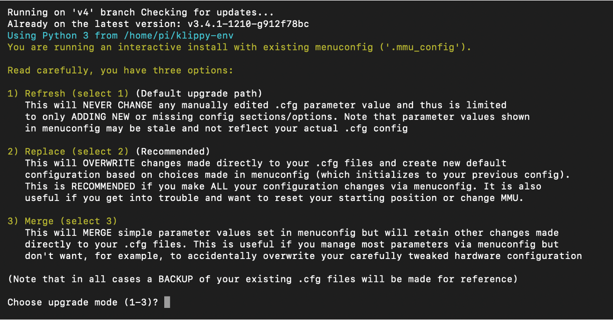

# Getting Started - Menuconfig Configurator / Installer

The Happy Hare v4 Installer and Configurator is a dynamic, menuconfig‑driven 
configuration management system designed to streamline both initial installation
and ongoing maintenance of Happy Hare. It uses a structured, deterministic workflow
that exposes only the parameters and capabilities relevant to your specific MMU hardware
and enabled features.

Where appropriate, the installer applies recommended defaults and sensible settings
across hardware definitions, GPIO assignments, and Happy Hare features. Options
not applicable to your configuration are suppressed and omitted from the generated files
in `config/mmu/base/` folder.

This rules‑driven approach simplifies setup, reduces configuration errors and frustration, 
and provides a clear, maintainable foundation for upgrading, managing, and enabling Happy
Hare capabilities.

## Design Goal
The intention is for users to manage most configuration settings through the interactive
`menuconfig` installer (`./install.sh -i`), without needing to edit Happy Hare 
configuration files directly. The rules‑driven interface ensures that all configuration
 choices remain consistent with the selected MMU hardware and supported features.

## Direct Modification of Configuration Files
Direct modification of Happy Hare configuration files remains possible when required, 
with installer options available to control merge and overwrite behavior to suit your
preferred workflow. However, users are encouraged to rely primarily on the `menuconfig`
installer, which may require unlearning older habits of editing configuration files
directly.

All menuconfig selections are mastered and stored in the `config/mmu/.mmu-config`
settings file, ensuring they are included in popular GitHub‑based printer‑configuration
backup mechanisms.

## Navigation

  

Navigation is intuitive and the same as any other `menuconfig` based interface.

| Key | Purpose |
| --- | ------- |
| **↑**   | move up |
| **↓**   | move down |
| **↵ or space**   | select a menu or option |
| **Esc** | go back to the previous menu |
| **R**   | reset a setting to its default value (if available) |
| **Q**   | quit and selectively save configuration changes |

The top-down flow guides you through the process in a logical, step by step manner. 
Depending on the MMU and selections you make, additional sub-menus and settings
will appear, enabling you to configure relevant settings for your setup.

**Config Warnings / Errors** are highlighted for you to review and correct.

## Managing Configuration Changes
When the `menuconfig` installer is launched after your initial setup and configuration, 
you will be prompted to choose how it should apply and reconcile configuration changes with 
locally applied settings.  

The installer supports three distinct modes for applying configuration changes:
_**R**efresh_, _**R**eplace_, and _**M**erge_.

  

1. **Refresh** (**Option 1 — Default upgrade path**) 
The Refresh mode preserves all parameter values that have been manually edited in your existing
Happy Hare `.cfg` files. It will only add new or missing configuration sections and options 
required by the current Happy Hare release. `menuconfig` values may appear outdated because
this mode does not update or overwrite existing parameters.

2. **Replace** (**Option 2 — Recommended**) 
This is the recommended mode **_when all configuration changes are managed through menuconfig_**.  
The **Replace** mode **OVERWRITES** any local changes you have made directly to your Happy Hare
`.cfg` files, resetting and regenerating a new configuration based solely on the selections
made in `menuconfig`.  

3. **Merge** (**Option 3 — Advanced**) 
Applies simple parameter updates from `menuconfig` while preserving other manual edits made to
your Happy Hare `.cfg` files. Useful when most settings are managed through `menuconfig` but
want hardware‑specific settings or tuning to remain untouched.

!!! notes 
    * `menuconfig` will never overwrite your existing configuration outright - it's moved
      to a timestamped backup directory (e.g. mmu-20260807_102329) before applying changes.
    * `menuconfig` will always automatically check and update Happy Hare to the latest 
      release from GitHub. To prevent this, launch `./install.sh`with `-z` flag to skip 
      the update check.
    * Following a klipper/kalico upgrade or hard reset, you may need to run `./install.sh` 
      again with the `-f` flag to restore all klipper/moonraker symbolic links to make
      sure everything is where it needs to be.
    * `menuconfig` does not have the ability to sync and import changes made directly to your Happy
      Hare `.cfg` files. If you have made changes and want them reflected in `menuconfig`, you will
      need to manually transpose them before using the `menuconfig` *Replace* option to 
      reset your configuration baseline.  It is for this reason it is recommended to
      manage all configuration changes through `menuconfig` where possible.

---