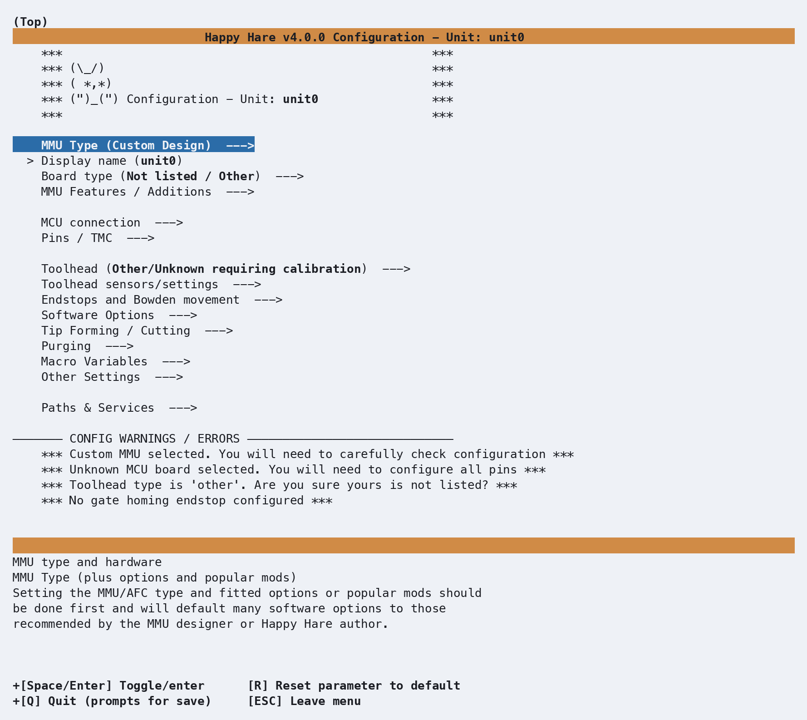
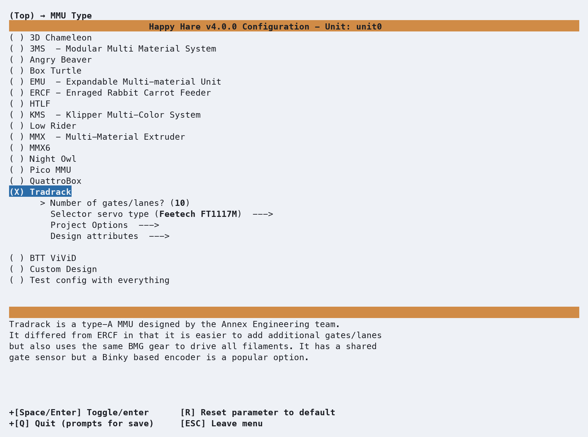
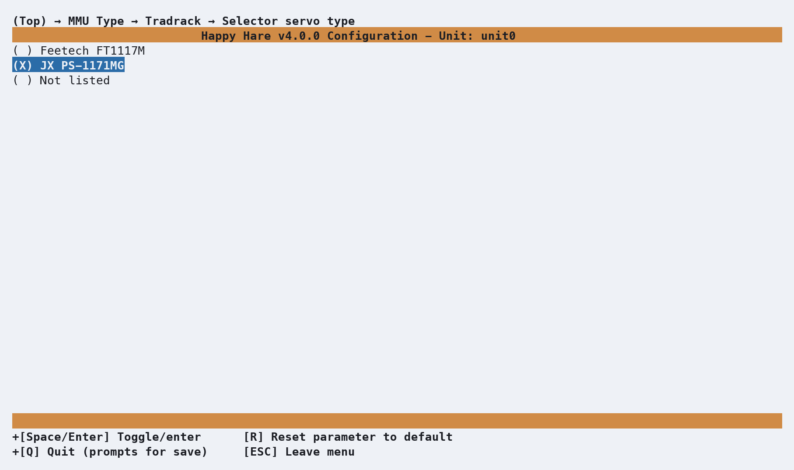
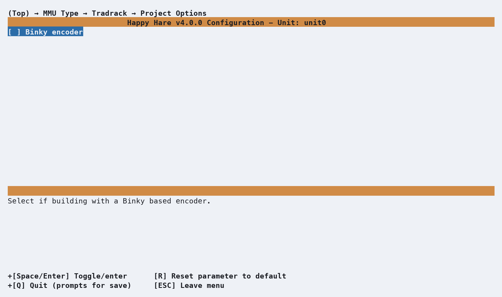
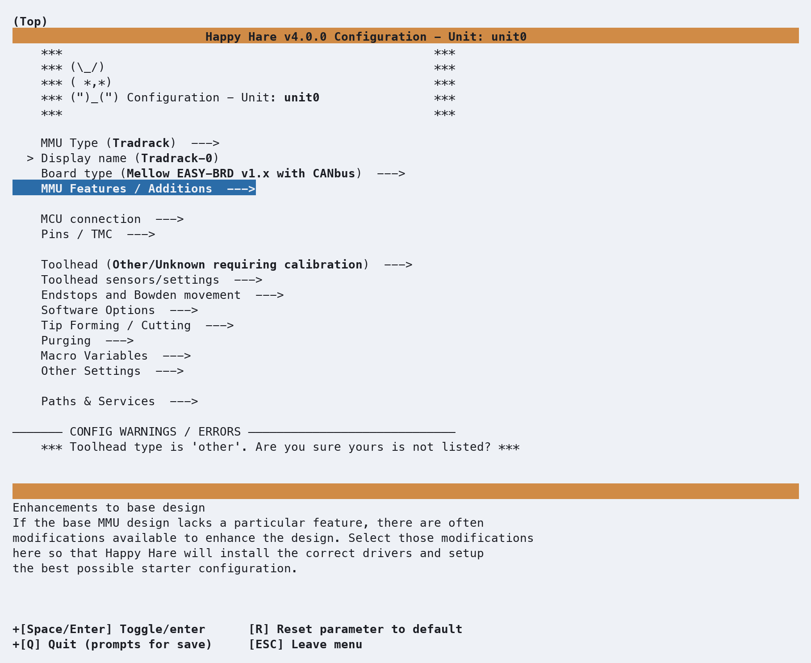
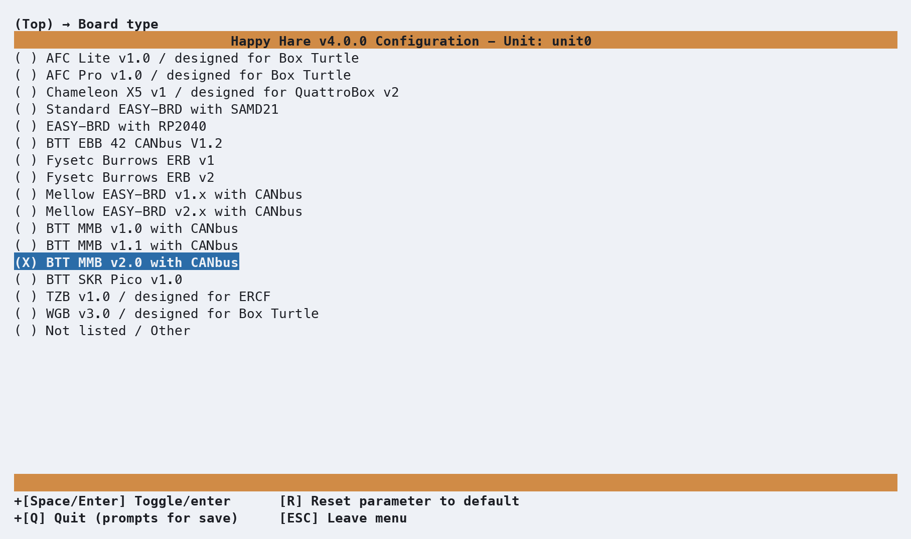

# Getting Started with Tradrack

This page walks through the first `menuconfig` pass for a Tradrack MMU — the
screens you'll see, in the order you'll see them, and the handful of choices worth
pausing on. It's the first of a set of getting-started pages; other pages cover
toolhead calibration and multi-unit setups in more depth. Here we're just getting
a Tradrack installed and talking to Klipper.

## Menuconfig Installer

From your Happy-Hare checkout:

```bash
./install.sh
```

The very first time you run this, there's no `.mmu_config` yet, so the installer
drops you straight into `menuconfig` — no separate flag needed.

<p align="center">
  
</p>

This is the installer's default state: `MMU Type` is `Custom Design`, the board is
unknown, and the **CONFIG WARNINGS / ERRORS** panel at the bottom lists exactly
that — four things still need a decision. As soon as you pick a real MMU type,
most of these clear themselves.

### Choosing the MMU type

Highlight **MMU Type** and press Enter. Move down to **Tradrack** and press ++space++ to select it. Once selected `(X) Tradrack`, four new 
options appear indented underneath — **Number of gates/lanes**, **Selector servo type**, **Project Options*** and **Design attributes** — options
that only make sense once Happy Hare knows this is a Tradrack. Other settings and options are also enabled based on the MMU design choice. 
<br>

<p align="center">
  
</p>
<br>
<br>
Enter **Number of gates/lanes** to match your setup. Tradrack is a modular type-A design with support for as many lanes as you can accommodate
in your build. The default is 10, but you can change it to any number from 1 to Happy Hare's maximum of 20.

<p align="center">
  
</p>
<br>
<br>
Next select the **Selector servo type**. Common options are provided - `Feetech FT1117M` (default) for people who sourced their servos in 
the US, `JX PS-1171MG` Aliexpress alternate and `Not listed` if you have a different servo. Servo settings such as min/max pulse widths, etc
are managed using `(Top) → Other Settings → Selector servo` options later in the `menuconfig` flow.

<p align="center">
  
</p>
<br>
<br>
Next, review applicable Project Options. If you added an optional Binky encoder, you can select and enable this here.

<p align="center">
  
</p>
<br>
<br>

Back out twice (++esc++, ++esc++) to return to the top menu, and review the warnings panel again. Three of the 
four warnings are already gone. The one that's left — *"`Toolhead type is 'other'`"* — is exactly what it sounds
like: Happy Hare still doesn't know your toolhead, and that's covered in a different getting-started page. 
Don't worry about it here.

<p align="center">
  
</p>


### Board type

Enter **Controller Board type**. Because you’ve already told the configurator this is a Tradrack, Happy Hare pre‑selects 
`Mellow EASY-BRD v1.x with CANbus` — a popular controller choice for Tradrack builds. If your Tradrack runs a different
board like an original or RP2040 based `EASY-BRD`, this is where you’d choose it; default pins for steppers, sensors, and
TMC drivers throughout the rest of `menuconfig` are derived from whatever controller you select here.

<p align="center">
  
</p>


### MCU connection
### MMU Features / Additions
### Pins: gear direction
### Picking a toolhead
## Validating Hardware Setup
## Calibration
## Checking Basic Operation
## Slicer Setup
## Printing with MMU
## What Next?

- Install [KlipperScreen (Happy Hare edition)](KlipperScreen.md) if you
  want a touchscreen front end, or drive everything from [Mainsail /
  Fluidd](Mainsail-Fluidd-Integration.md) — either works, and both are
  covered.
- From here, explore the rest of this site's [Features](Feature-Espooler.md)
  section one page at a time as you actually need them — Spoolman
  integration, NFC/RFID tags, EndlessSpool, and the rest. Trying to absorb
  all of it before your first print is the fastest way to feel
  overwhelmed by an MMU that, day to day, mostly just works.

---
