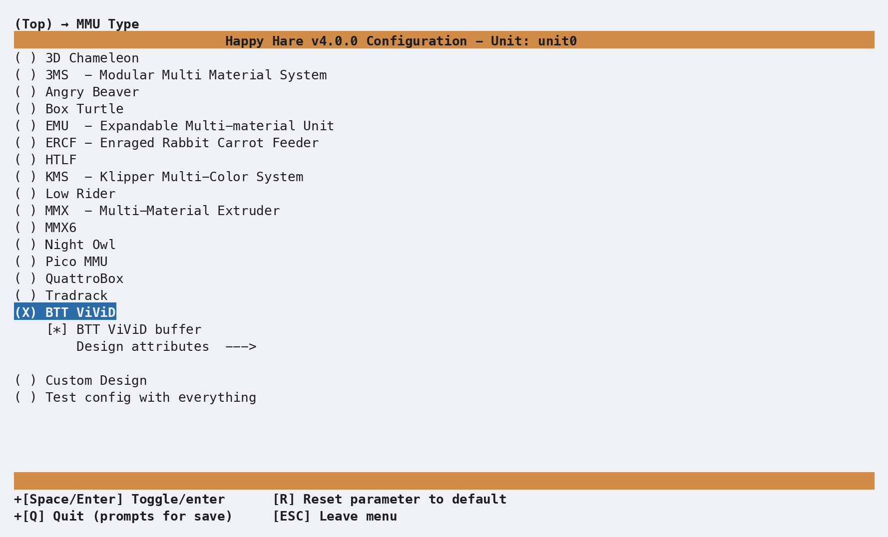
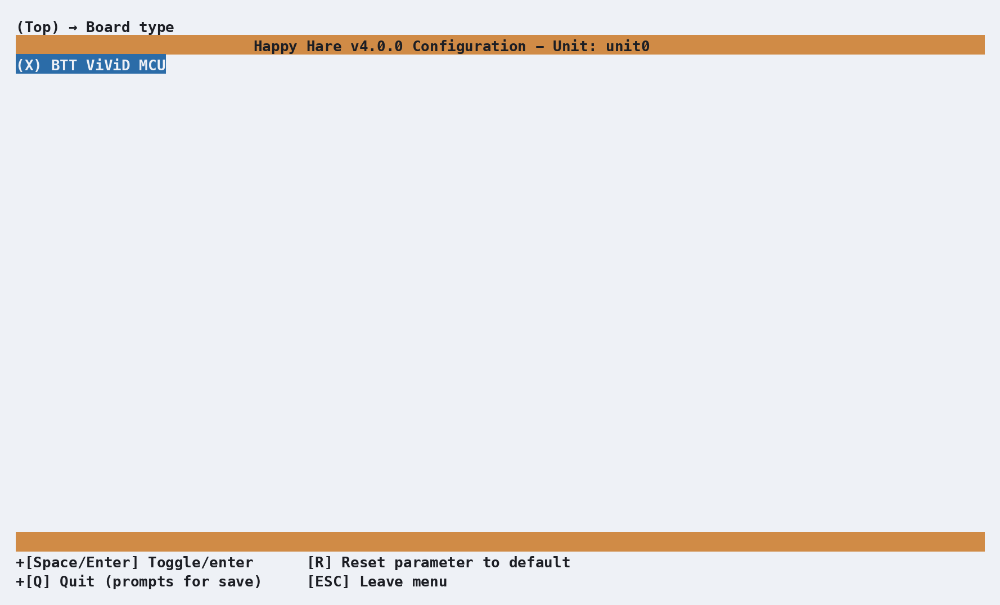
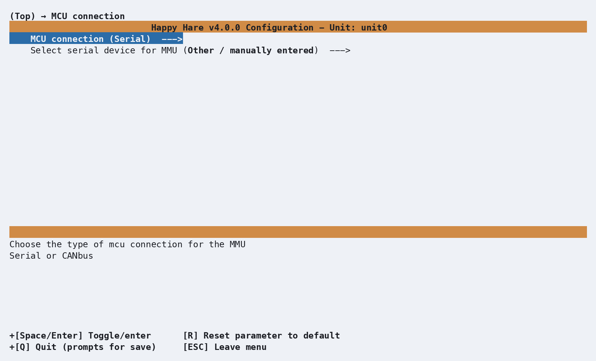
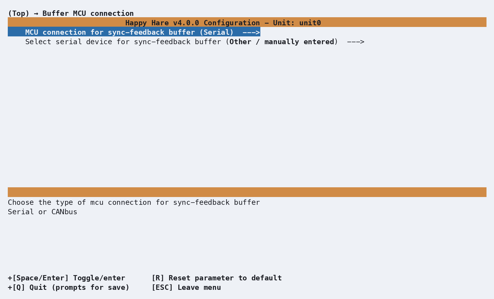
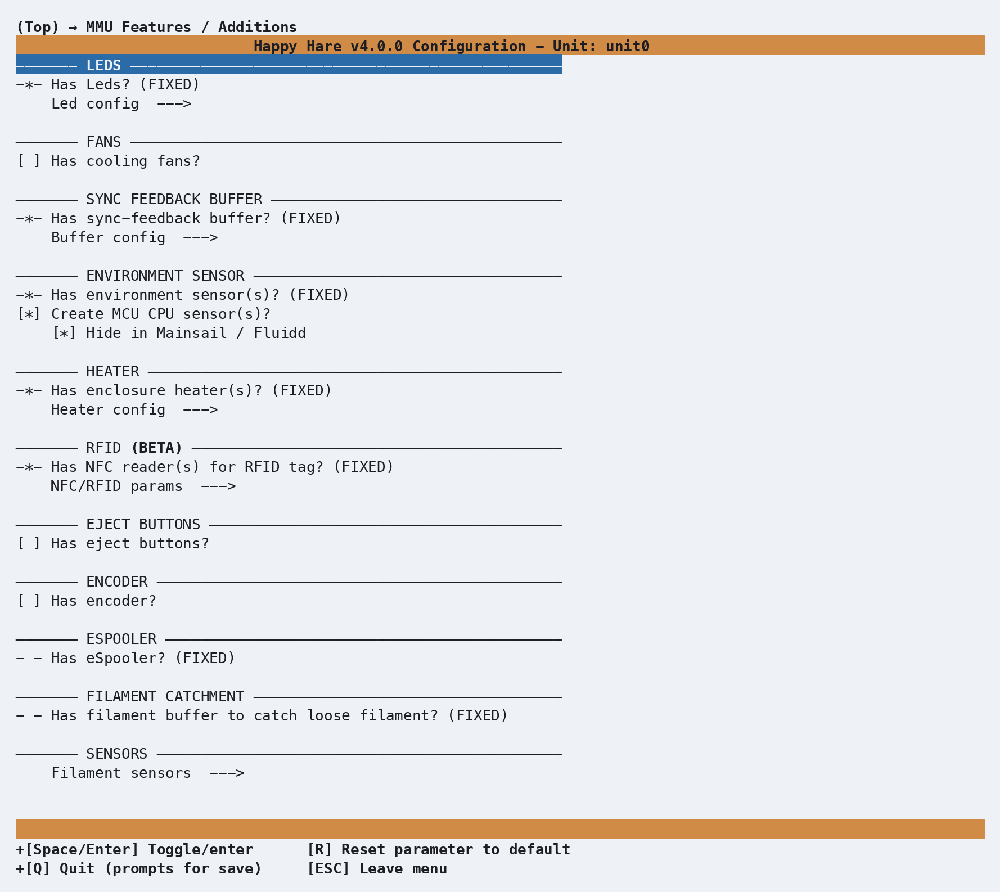
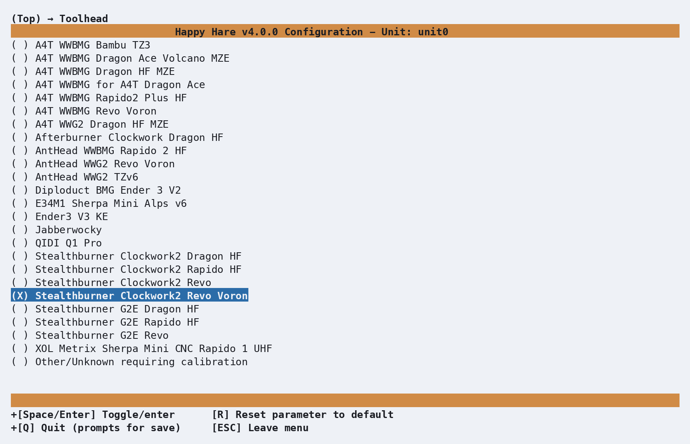
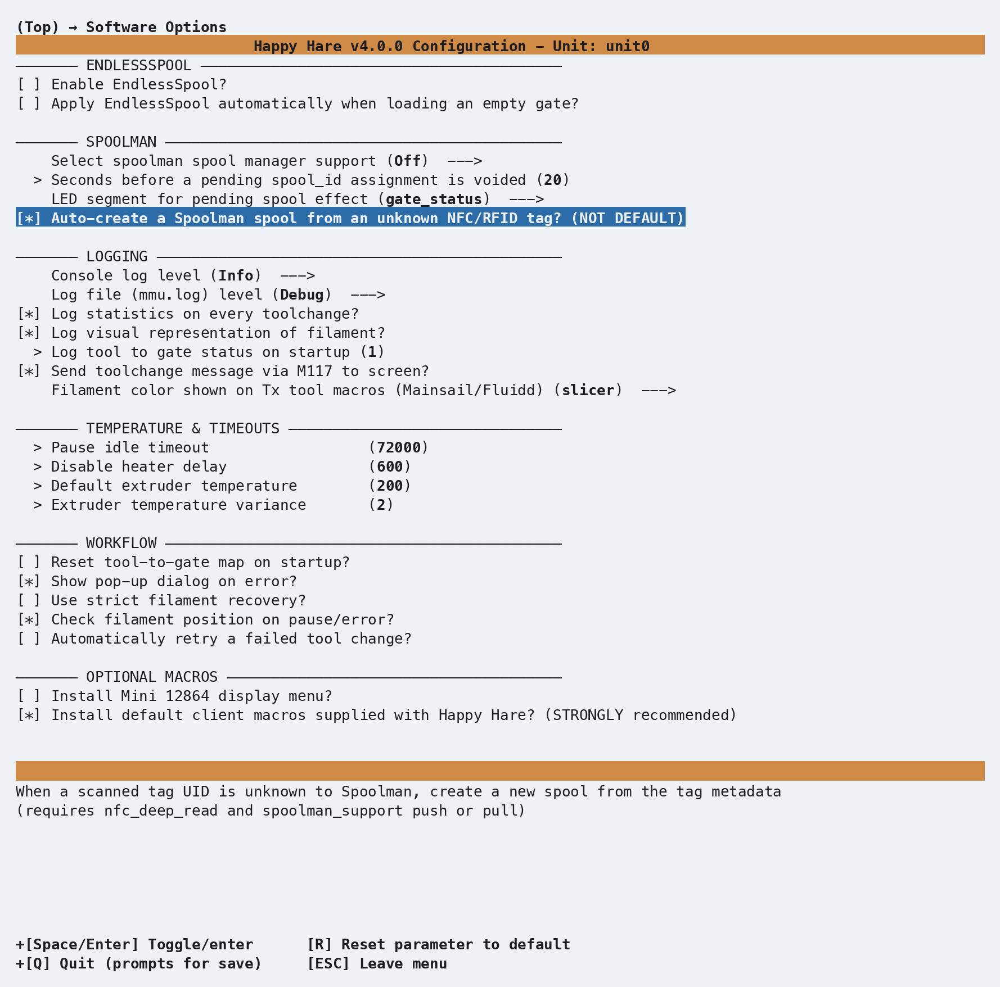

# Getting Started with BTT ViViD

BTT ViViD is a fully-specified design - unlike a modular design such as ERCF or
Box Turtle, almost every menuconfig default is already correct the moment you
pick it: board, pins, LEDs, environment sensor, heater and per-gate NFC
readers all come pre-filled. What's genuinely left for you to decide is
small: whether you have the official ViViD buffer board, and which of your
computer's serial devices is which - because a ViViD unit and its buffer are
two separate controller boards, not one.

## Menuconfig Installer

From your Happy-Hare checkout:

```bash
./install.sh
```

The very first time you run this, there's no `.mmu_config` yet, so the
installer drops you straight into `menuconfig` - no separate flag needed.

## Choosing the MMU type

Highlight **MMU Type** and press Enter, move down to **BTT ViViD** and press
Space to select it. A second line appears indented directly underneath it -
**BTT ViViD buffer** - already checked:

<p align="center">
  
</p>

Leave **BTT ViViD buffer** checked if you have the official buffer board
fitted on the bowden tube (its own separate MCU, with its own sync-feedback
tension/compression sensors already wired) - that's the common case, and it's
suggested on by default. Uncheck it only if you're using a different buffer
mechanism entirely, which you'd then add under **MMU Features / Additions**
instead.

**Board type** doesn't need a visit at all - ViViD only has one controller
board, **BTT ViViD MCU**, and it's already selected:

<p align="center">
  
</p>

Gate count is fixed at `4` too; unlike a modular design, there's no separate
prompt for it.

## MCU connections: two separate boards

This is the one part of ViViD setup that genuinely needs your input, and it
needs it twice - once for the ViViD unit's own MCU, and once for the
buffer's, because they're two independent boards that each show up as their
own serial device.

From the top menu, enter **MCU connection**:

<p align="center">
  
</p>

This is a small submenu, not a single screen: the first row is the
Serial/CANbus choice (already `Serial`, right for a USB-attached board), and
the second - **Select serial device for MMU** - is where you actually pick
*which* serial device. Enter that second row and every currently-connected
device shows up by its full `/dev/serial/by-id/` name - BTT's own boards name
themselves clearly, so telling the two apart is normally just reading the
list:

```text
Select serial device for MMU  --->
    ( ) usb-Klipper_stm32g0b1xx_vivid_410030000150505539323520-if00
    ( ) usb-Klipper_stm32f042x6_buffer_2D0001000143565335383320-if00
    ( ) Other / manually entered
```

The ViViD unit's device string contains `vivid`, the buffer's contains
`buffer`. Pick the `vivid` one here - it shows `Other / manually entered`
above only because nothing was plugged in when this screenshot was captured.

Back out to the top and enter the buffer's own connection screen, **Buffer
MCU connection**:

<p align="center">
  
</p>

Same shape, same list, but this time enter **Select serial device for
sync-feedback buffer** and pick the `buffer` one instead:

```text
Select serial device for sync-feedback buffer  --->
    ( ) usb-Klipper_stm32g0b1xx_vivid_410030000150505539323520-if00
    (X) usb-Klipper_stm32f042x6_buffer_2D0001000143565335383320-if00
    ( ) Other / manually entered
```

If a board you expect isn't listed at all, Klipper doesn't have a valid
serial connection to it yet - check that its firmware is flashed and it's
actually plugged in before assuming menuconfig is at fault. **Other / manually
entered** lets you type the exact `/dev/serial/by-id/...` path directly,
which works identically to picking it from the list once the device does
show up.

## MMU Features / Additions

Worth a glance even though there's nothing to add for a stock ViViD:

<p align="center">
  
</p>

**LEDs**, the **sync-feedback buffer** (supplied by the buffer board from the
previous step), the **environment sensor**, the **heater**, and the
**NFC readers** are all already switched on and marked
`(FIXED)`, because every stock ViViD ships with them. The old-style
**filament buffer to catch loose filament** is fixed *off* instead - the
filament movement also moves the spool on this design. **Cooling fans**,
**eject buttons** and an **encoder** are the genuine options here, and all
default off; enable whichever ones you actually built.

## Picking a toolhead

From the top menu, enter **Toolhead**:

<p align="center">
  
</p>

This step is entirely optional - skip it and Happy Hare falls back to
generic "Other/Unknown" dimensions, a perfectly normal starting point. If
your toolhead (extruder + hotend combo) happens to be in the list, though,
picking it fills in real, community-measured values
(extruder-entrance-to-nozzle distance, residual filament) instead of
guesses, for free - here we've picked **Stealthburner Clockwork2 Revo
Voron** at random, just to show what selecting one does. This choice is the
same regardless of MMU type - it isn't ViViD-specific.

## An example software option: Spoolman NFC auto-create

From the top menu, enter **Software Options**. Since a stock ViViD already
has an NFC reader on every gate, one option in the **Spoolman** section here
is worth calling out specifically rather than skimming past: **Auto-create a
Spoolman spool from an unknown NFC/RFID tag?**

<p align="center">
  
</p>

**Select spoolman spool manager support** defaults to `Off` regardless of MMU
type - ViViD's built-in NFC readers don't change that default, they just make
the feature genuinely worth turning on. **Auto-create** itself needs deep NFC
reads enabled and **Push** or **Pull** selected above it, not just
`Read-only` - creating a spool record is itself a write back to Spoolman, so
a mode that only reads isn't enough. With both set, scanning a tag Spoolman
has never seen creates a new spool record from the tag's own metadata
automatically, instead of the print pausing for you to assign one by hand.
That kind of dependency is exactly what the on-screen help for any option
spells out, so read it before assuming a checkbox alone will do something.

## Explore the rest

That covers everything genuinely specific to a stock ViViD, but it's only a
fraction of the menu. **Endstops and Bowden movement**, **Tip Forming /
Cutting**, **Purging** and the rest are all worth a look - scroll all the way
from the top to **Paths & Services** at the bottom at least once. Nothing you
look at will break anything: moving the highlight and pressing `?` for help
costs nothing, and `R` resets whatever's highlighted back to its default.

## Saving, and coming back later

When you're done, press **Esc** from the top level (or **Q**) to get the
save prompt, and confirm. Happy Hare writes your `.cfg` files from what you
chose.

The installer only forces `menuconfig` open automatically on that very first
run. After that, running `./install.sh` again just upgrades in place - it
won't reopen the menu. To go back in and change something, use:

```bash
./install.sh -i
```

This is the normal way to revisit any setting on this page - there's no need
to ever hand-edit the generated `.cfg` files directly.

!!! note
    The one thing worth knowing:
    if you've hand-edited a `.cfg` file since your last visit to `menuconfig`,
    `-i` will ask how to reconcile that — **Refresh** (keep your manual edits, and
    just add new options), **Replace** (regenerate everything from menuconfig, discarding
    direct edits) or **Merge** (attempts to merge manual edits into menuconfig)

    If you only ever configure through `menuconfig`, as this page assumes, option 2
    (**Refresh**) is the recommended choice because it rebuilds your Happy Hare
    klipper config files ensuring a clean config and any future update made to the
    Happy Hare sofware.

## Validating Hardware Setup

Follow [Hardware Validation](Hardware-Validation.md), checking the ViViD and
buffer MCUs separately. ViViD uses an indexed selector, so validate its index
switches and select every gate; it has no encoder or eSpooler unless you added
one to the standard build.

## Calibration

## Checking Basic Operation

## Slicer Setup

## Printing with MMU

## What Next?

---
