# KlipperScreen

[KlipperScreen - Happy Hare Edition](https://github.com/moggieuk/KlipperScreen-Happy-Hare-Edition)
is a fork of KlipperScreen maintained alongside Happy Hare itself, adding a
dedicated MMU panel on top of everything stock KlipperScreen already does.
It's the most complete touchscreen UI for day-to-day MMU operation - gate/tool
selection, state recovery, and editing the gate map, all without needing a
console.

## Getting the fork

The fork replaces your existing KlipperScreen install rather than running
alongside it, so get a stock KlipperScreen working first - see
[KlipperScreen's own docs](https://klipperscreen.readthedocs.io/en/latest/)
if you haven't already. Make sure Happy Hare itself is fully up to date too,
since the fork tracks features added there.

Once both are in place, from your Raspberry Pi:

```bash
cd ~
mv KlipperScreen KlipperScreen.orig
git clone https://github.com/moggieuk/KlipperScreen-Happy-Hare-Edition.git KlipperScreen

cd ~/KlipperScreen/happy_hare
./install_ks.sh -g <num_gates>
```

`<num_gates>` is the number of gates/lanes your MMU has (e.g. `9` for a
9-gate Box Turtle). This installs the Happy Hare-specific images and menus,
registers the fork with Moonraker's update manager (pointed at the fork's own
repository instead of upstream KlipperScreen), and restarts KlipperScreen.

!!! tip
    Re-run the same `./install_ks.sh -g <num_gates>` command any time after
    updating KlipperScreen - it refreshes the Happy Hare-specific images and
    menus, which a plain update doesn't touch. It's always safe to run again.

`install_ks.sh` also takes:

```text
-c <klipper_config_dir>  override the Klipper config directory (needed on a
                          headless setup with no printer attached yet)
-z  skip the GitHub update check
-j  force-reinstall the JetBrains Mono font
```

The fork tracks upstream KlipperScreen closely - the maintainer re-merges
from the original project roughly every two weeks, so it keeps pace with
stock KlipperScreen's own updates and features rather than drifting into its
own thing.

!!! warning "Important"
    Only tested on a single 640x480 landscape display so far (a BTT TFT5.0).
    Vertical mounting is untested and unlikely to lay out well.

If KlipperScreen shows a version-mismatch popup after updating either Happy
Hare or the fork, follow whatever the popup itself recommends - it's a live
check against the actually-running Happy Hare version, not a static message.

## Main Panel

<p align="center">
  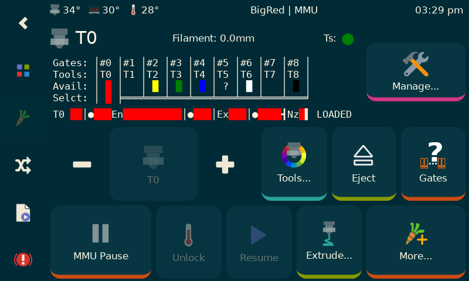
</p>

Accessed via the carrot icon on the left navbar (or from buttons on the
KlipperScreen home/print pages instead, if you turn the carrot off in
settings). Filament colour per gate shows here directly from the gate map's
`gate_material`/`gate_color` - set either as defaults in `mmu.cfg` or live
with [`MMU_GATE_MAP`](Command-Reference.md#mmu_gate_map). If a toolhead
sensor is fitted, its state (detected/empty/disabled) shows near the
`Manage...` button.

The panel works with the concept of a **Tool** - a virtual entity, since
Tool-to-Gate mapping means the tool you select and the physical gate that
services it aren't necessarily the same number. While actively printing the
same panel looks a little different:

<p align="center">
  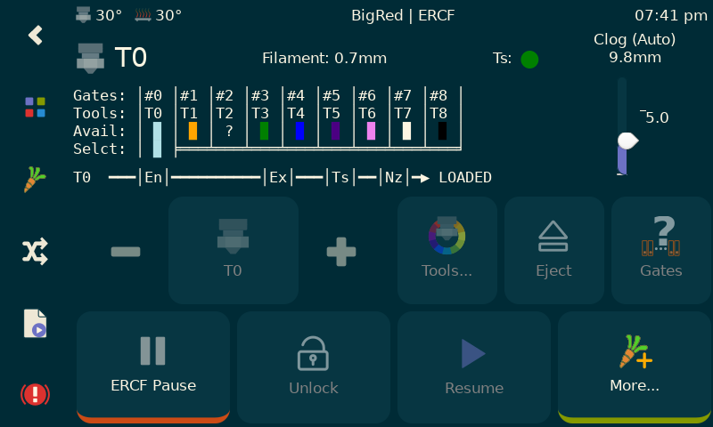
</p>

The top-left tool icon also indicates whether the gear stepper is
synchronized with the extruder. If an encoder is fitted, the top-left button
becomes a live clog/runout "thermometer": the gap between extruder and
encoder-measured movement is the "temperature," rising as it grows: FlowGuard's
`desired_headroom` is the safe gap this monitors against, and hitting the top
triggers a runout condition (see
[Feature: FlowGuard](Feature-FlowGuard.md)). With an encoder you'll also see
a live extrusion percentage while printing - a quick way to spot
under-extrusion, generally expected to sit above roughly 95%:

<p align="center">
  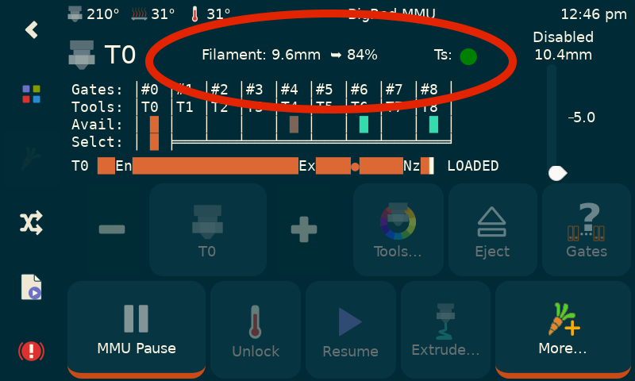
</p>

!!! note
    When an MMU error pauses the print, the `Pause` button (which can also
    manually *force* a pause) changes to `Last Error` - a quick way to recall
    what went wrong, and which toolchange was in progress, without checking
    the console.

    <p align="center">
      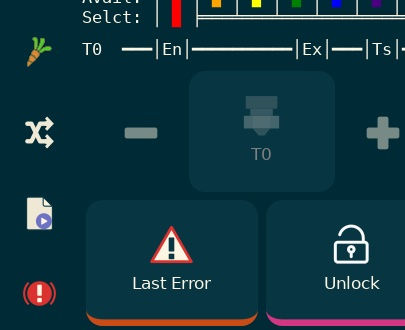
    </p>

### Tool Picker Panel

An alternative way to pick a tool, showing which gate it maps to and that
gate's filament type/colour at a glance:

<p align="center">
  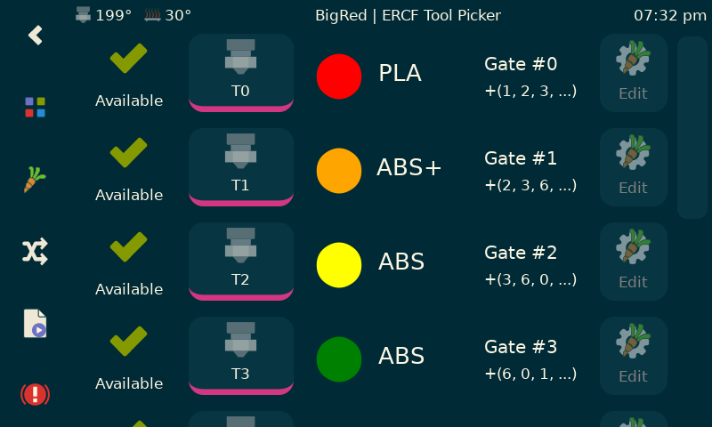
</p>

### Bypass

If a filament bypass is fitted (see
[Feature: Filament Bypass](Feature-Filament-Bypass.md)), clicking just left of
`T0` opens the bypass selector:

<p align="center">
  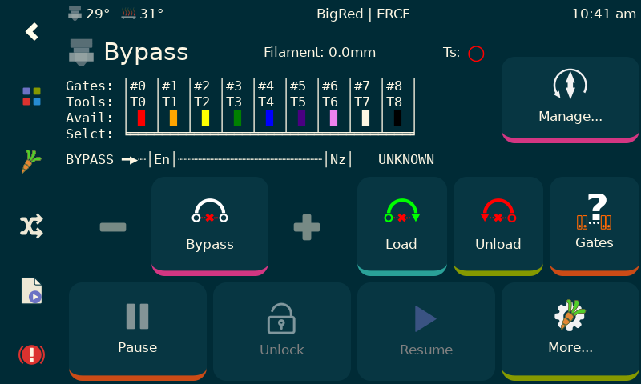
</p>

With bypass selected, the `Colors...`/`Eject` buttons become `Load
(Bypass)`/`Unload (Bypass)`.

## State Management & Recovery

Accessed via the `Manage...` button (top right) when not printing. Working
in physical **Gate** terms rather than Tool, the exact panel contents depend
on your MMU's selector design - linear-selector designs like ERCF and
Tradrack:

<p align="center">
  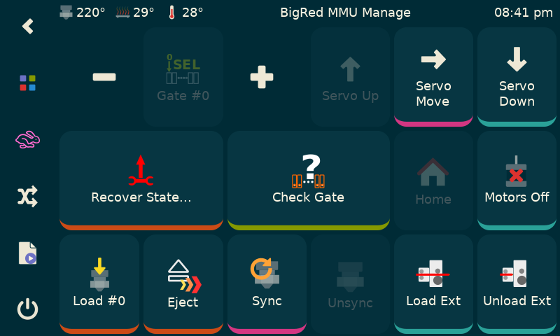
</p>

rotary-selector designs like 3D Chameleon and PicoMMU:

<p align="center">
  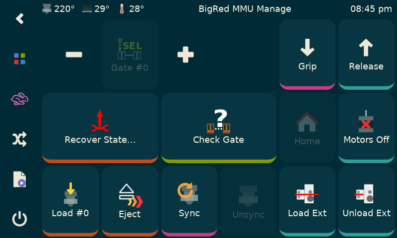
</p>

and gear-per-gate designs with no physical selector at all (Box Turtle,
Night Owl, 3MS, Angry Beaver, and similar):

<p align="center">
  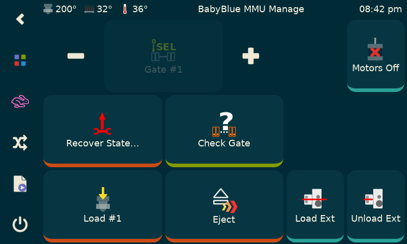
</p>

Most functions are self-explanatory; `Load Extruder`/`Unload Extruder` act on
the extruder only, exactly as named.

### Recovering State

The `Recover State...` button on the Manage panel is the one to know: since
Happy Hare tracks its own state and refuses actions it thinks are unsafe, an
error or manual intervention can occasionally leave that tracked state out of
sync with reality.

<p align="center">
  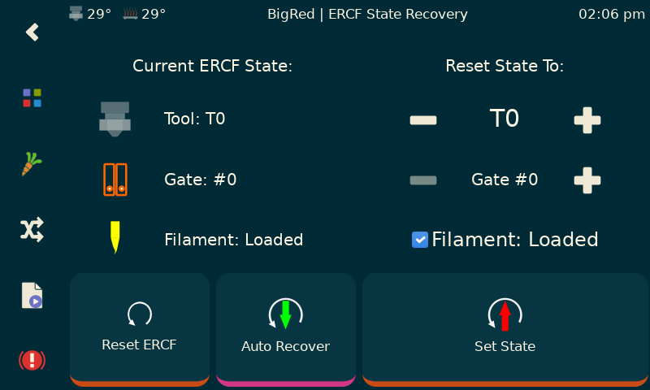
</p>

It shows what Happy Hare currently believes, lets you correct it manually, or
run `Auto Recover` to have Happy Hare re-check just the loaded/unloaded
filament state itself. See [Operation](Operation.md#state-recovery) for what
state recovery actually does and when it's needed.

!!! note
    Moving the selector from the Manage panel changes the *gate* state
    directly - a real physical move. Because of Tool-to-Gate mapping, the
    *tool* resets to unknown afterward: a tool can map to more than one gate
    (EndlessSpool), so which tool that gate now serves isn't automatically
    knowable.

## Filament Editor

<p align="center">
  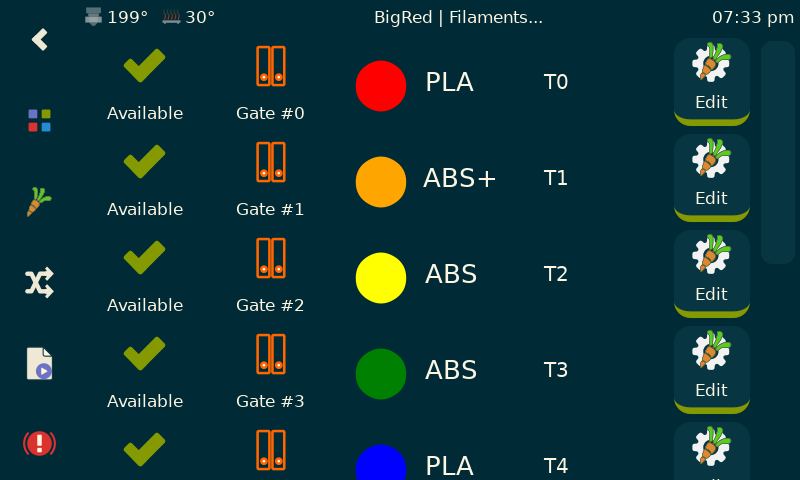
</p>

Lists filaments by gate, alongside the tool each currently maps to (usually,
but not always, the same number - a gate can back more than one tool).
`Edit...` opens per-gate detail:

<p align="center">
  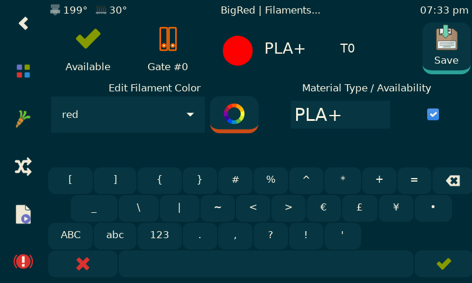
</p>

Colour is set by name or an RGB picker; material accepts capital letters,
digits, and `+`/`-`/`_` (no spaces). Filament availability can also be set
here directly, skipping an automatic gate check if you're confident it's
correct.

## TTG (Tool-to-Gate) Map and EndlessSpool Editor

<p align="center">
  
</p>

Select a tool, then change which gate it maps to (multiple tools can map to
the same gate). The grouping graphic to the right shows that gate's
EndlessSpool group, managed at the bottom of the screen - `+`/`-` edits other
groups (named `A`, `B`, `C`, ...), and the checkbox next to a group toggles
EndlessSpool on/off for it. `Save` commits the whole map at once; `Reset`
restores your configured defaults.

In the panel shown, `T0` maps to Gate 0, itself part of an EndlessSpool group
spanning Gates 0-3; `T2`-`T5` all map to Gate 5; and so on. See
[Feature: Gate/TTG Maps](Feature-Gate-TTG-Maps.md) for the underlying
mechanics.

## Spoolman "filaments" panel

If Spoolman is enabled, this can be more useful than the plain Filament
Editor above (though a spool ID can still be edited from either that panel
or with [`MMU_GATE_MAP`](Command-Reference.md#mmu_gate_map)):

<p align="center">
  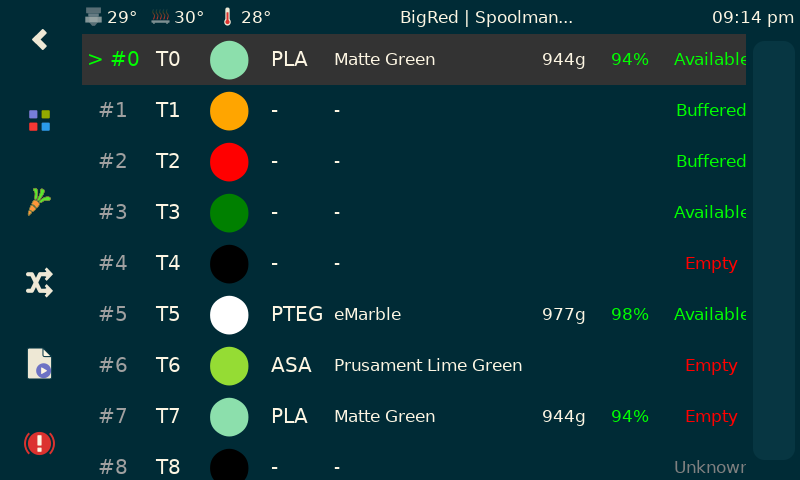
</p>

See [Feature: Spoolman Integration](Feature-Spoolman.md) for the underlying
sync behaviour this panel is editing.

## MMU Options

A handful of settings in KlipperScreen's own configuration menu adjust MMU
behaviour on the display side:

<p align="center">
  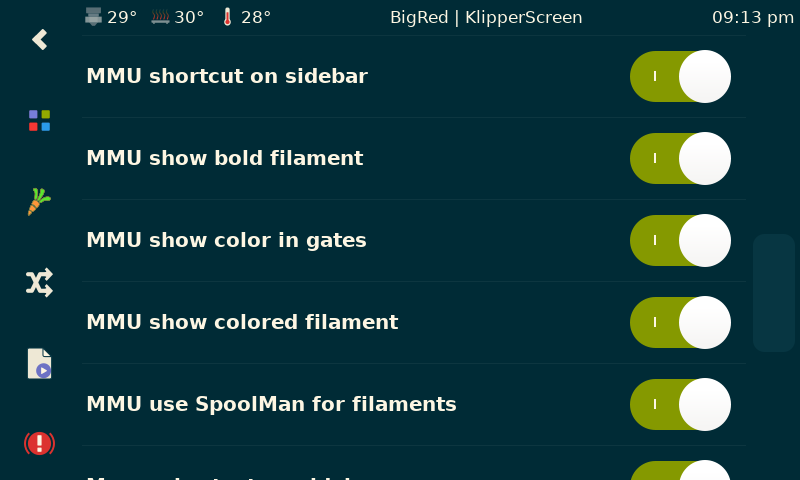
</p>

## See also

- [Mainsail / Fluidd](Mainsail-Fluidd-Integration.md) - the equivalent web-UI
  panels
- [Command Reference: `MMU_GATE_MAP`](Command-Reference.md#mmu_gate_map)
- [Feature: Gate/TTG Maps](Feature-Gate-TTG-Maps.md)
- [Feature: Spoolman Integration](Feature-Spoolman.md)

---
