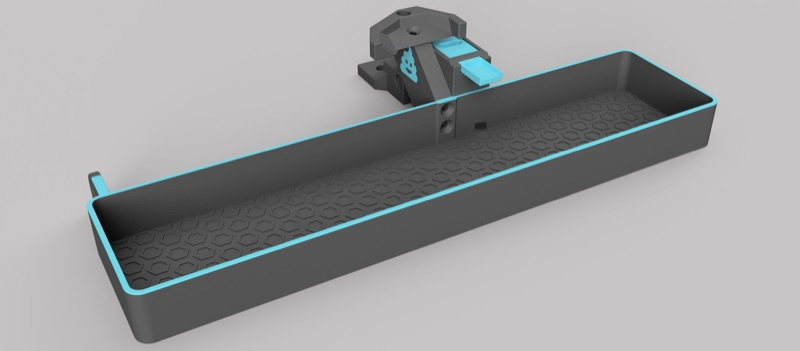
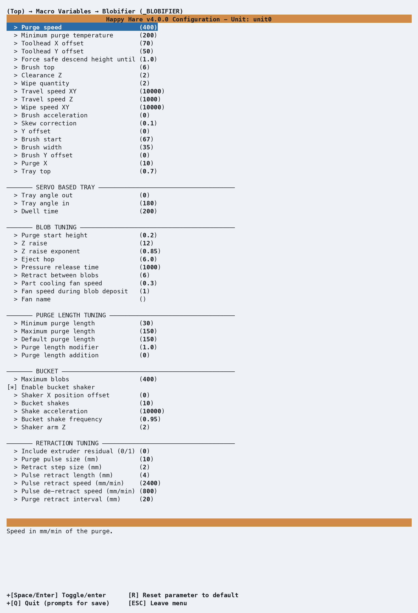

# Macro: Blobifier

## What it does

  

Tunes Blobifier, a standalone purge system that replaces the slicer's wipe
tower with a purge tray and collection bucket - fully native now, via
menuconfig's **Purging** screen (**Have Blobifier?**), rather than a
separate `[include ...]` file to copy in. Genuinely the largest single
tuning surface on this site, third-party-maintained and reproduced here in
full rather than left to its upstream README alone. Physical build
instructions are at [Blobifier's own project
page](https://github.com/Dendrowen/Blobifier).

## Where it's applied

Defined in `blobifier.cfg`, active once `purge_macro: BLOBIFIER` in
`mmu.cfg` (set automatically once **Have Blobifier?** is enabled under
menuconfig's **Purging** screen - the tray actuator type, servo or stepper,
is also chosen there, not on the Macro Variables screen below). Three
extension points fire around the purge itself, distinct from - and not
listed on - [Macro Customization](Macro-Customization.md)'s general table,
since they're scoped to Blobifier's own sequence rather than Happy Hare's
load/unload cycle: `user_pre_blobifier_extension` (at the very start, after
state is saved), `user_post_purge_extension` (after purging and cleaning,
before Z is restored), and `user_post_blobifier_extension` (after Z is
restored). All three exist specifically for a gantry-mounted brush/nozzle
leak-stop setup that needs its own parking logic around the sequence; leave
them blank for the default bed-mounted brush.

!!! tip
    Parking the nozzle over the tray during a swap is better handled
    through the standard parking configuration in [Macro:
    Sequence](Macro-Sequence.md) than the older
    `variable_user_post_form_tip_extension: 'BLOBIFIER_PARK'` approach -
    the newer mechanism accounts for toolhead movement more generally
    rather than being specific to this one add-on.

!!! note
    These three hooks - and `clean_macro`, which points at the nozzle
    cleaning macro to run - aren't exposed in menuconfig at all. Set them
    by hand-editing `mmu_macro_vars.cfg` directly.

## Configuration

  

`_BLOBIFIER_VARS` in `mmu_macro_vars.cfg`, reachable from menuconfig's
**Macro Variables → Blobifier (\_BLOBIFIER)** screen shown above, once
Blobifier is enabled. The full ~60-variable table, organized the same way
as the shipped file's own sections, is on [Macro Variables:
Blobifier](Reference-Macro-Vars.md#blobifier-_blobifier_vars) - not repeated here.
Three settings are explicitly flagged **must calibrate** rather than
tune-to-taste: `toolhead_x`/`toolhead_y` (nozzle-to-toolhead-edge offsets)
and `tray_top` (the tray's real Z height) - the shipped defaults are a
specific build's measurements, not a sensible starting point for yours.

## See also

- [Feature: Tip Forming and Purging](Feature-Tip-Forming-Purging.md) - the
  `purge_macro` setting that activates Blobifier as an alternative to
  `_MMU_PURGE`
- [Macro Variables: Blobifier](Reference-Macro-Vars.md#blobifier-_blobifier_vars) -
  every `_BLOBIFIER_VARS` setting in full
- [Toolchange Movement](Toolchange-Movement.md#tip-cutting-options) - a
  worked example combining Blobifier with a fully custom park/purge, no
  wipe tower
- [Macro: Purge](Macro-Purge.md) - the simpler built-in alternative

---
