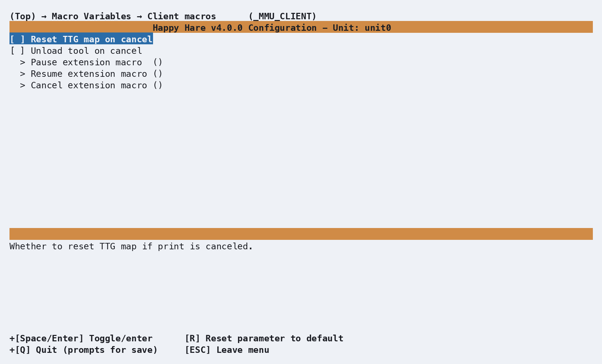

# Macro: Client

## What it does

Supplemental configuration for the `PAUSE`/`RESUME`/`CANCEL_PRINT` macros
Happy Hare ships as a drop-in, MMU-aware replacement for Klipper's own base
versions. Most of the actual toolhead behavior around a pause/resume/cancel
- parking, z-hop, retraction - is controlled by [Macro:
Sequence](Macro-Sequence.md) instead; this page's settings are specifically
what happens *on cancel*, plus three extension hooks.

## Where it's applied

- **`reset_ttg_on_cancel`**/**`unload_tool_on_cancel`** - whether
  `CANCEL_PRINT` also resets the tool-to-gate map / unloads the current
  tool, in addition to Klipper's own cancel behavior.
- **`user_pause_extension`** - runs after Klipper's base pause.
- **`user_resume_extension`** - runs *before* Klipper's base resume.
- **`user_cancel_extension`** - runs *before* Klipper's base `cancel_print`.

See [Operation: What Happens When the MMU
Pauses](Operation.md#what-happens-when-the-mmu-pauses) and [State
Recovery](Operation.md#state-recovery) for the pause → fix → resume/recover
flow these macros are part of - only relevant if you're using the shipped
client macros in the first place; the [Toolchange
Movement](Toolchange-Movement.md) `variable_enable_park_*`/park-position
settings apply regardless.

## Configuration

  

`_MMU_CLIENT_VARS` in `mmu_macro_vars.cfg`, reachable from menuconfig's
**Macro Variables → Client macros (\_MMU_CLIENT)** screen shown above. Full
variable table: [Macro Variables: Client
macros](Reference-Macro-Vars.md#client-macros-_mmu_client_vars).

## See also

- [Macro Customization](Macro-Customization.md) - the extension mechanism
  the three hooks above use
- [Macro Variables: Client macros](Reference-Macro-Vars.md#client-macros-_mmu_client_vars) -
  every `_MMU_CLIENT_VARS` setting in full
- [Macro: Sequence](Macro-Sequence.md) - the parking/z-hop/retract behavior
  around pause, resume, and cancel
- [Operation](Operation.md#what-happens-when-the-mmu-pauses) - the full
  pause → fix → resume/recover flow

---
