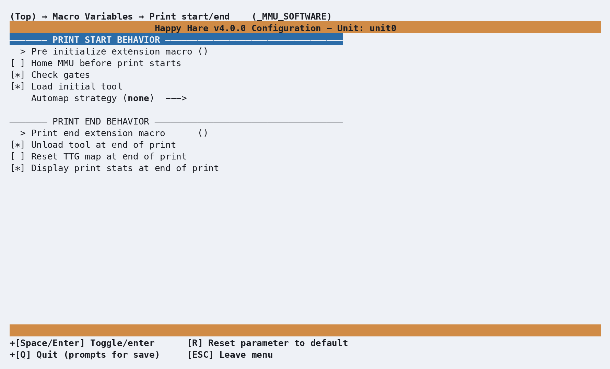

# Macro: Print Start/End

## What it does

Controls the checks and behavior Happy Hare runs automatically at the start
and end of every print - whether to home the MMU first, check every gate
that's about to be used actually has filament, load the first tool, and
what happens when the print finishes (or is unloaded, TTG-reset, and so on).

## Where it's applied

Three commands, normally called from your slicer's start/end gcode (see
[Slicer Setup](Slicer-Setup.md#customizing-the-startend-macros) for the
calling convention):

- **`MMU_START_SETUP`** and **`MMU_START_LOAD_INITIAL_TOOL`** - the print
  start sequence. `user_pre_initialize_extension` runs at the very start of
  `MMU_START_SETUP`, commonly to home the toolhead (`G28`) before anything
  MMU-specific happens.
- **`MMU_END`** - the print end sequence. `user_print_end_extension` runs at
  its very start, a good place to move the toolhead off the finished print
  before Happy Hare's own end-of-print behavior (unload, TTG reset, stats
  dump) runs.

## Configuration

  

Every setting here lives in `_MMU_SOFTWARE_VARS` in `mmu_macro_vars.cfg`,
reachable from menuconfig's **Macro Variables → Print start/end
(\_MMU_SOFTWARE)** screen shown above. The full variable table is on [Macro
Variables: Print start/end](Macro-Vars.md#print-startend-_mmu_software_vars)
- a few worth knowing about specifically:

- **`automap_strategy`** drives Happy Hare's automatic tool-to-gate
  remapping against the slicer's tool map at print start - see [Feature:
  Gate/TTG Maps](Feature-Gate-TTG-Maps.md#automatic-ttg-mapping) for how the
  matching itself works.
- **`check_gates`** (on by default) catches a print starting on an empty
  gate before it wastes time and filament, rather than failing mid-print.
- **`unload_tool`**/**`reset_ttg`**/**`dump_stats`** control what "end of
  print" actually does to the MMU's state - unload the tool, reset the
  tool-to-gate map, and print the swap/gate statistics summary
  ([Feature: Statistics & Consumption Counters](Feature-Statistics-Counters.md))
  respectively.

## See also

- [Macro Customization](Macro-Customization.md) - the extension mechanism
  `user_pre_initialize_extension`/`user_print_end_extension` above use
- [Macro Variables: Print start/end](Macro-Vars.md#print-startend-_mmu_software_vars) -
  every `_MMU_SOFTWARE_VARS` setting in full
- [Slicer Setup](Slicer-Setup.md#customizing-the-startend-macros) - where
  `MMU_START_SETUP`/`MMU_START_LOAD_INITIAL_TOOL`/`MMU_END` are actually
  called from
- [Feature: Gate/TTG Maps](Feature-Gate-TTG-Maps.md#automatic-ttg-mapping) -
  the automap strategy this page's `automap_strategy` setting drives

---
