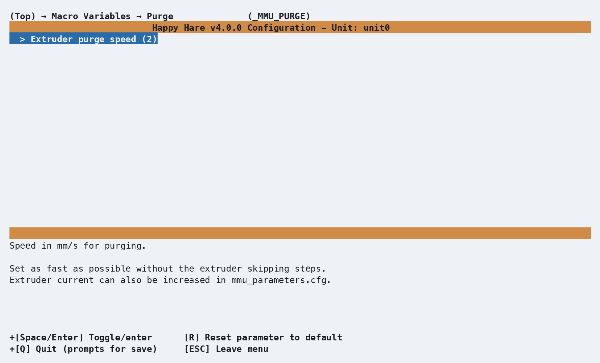

# Macro: Purge

## What it does

Happy Hare's simple, standalone reference purge - a basic bucket purge you
can use as-is, or as a starting point for your own custom purge macro.
[Blobifier](Macro-Blobifier.md) is the far more capable alternative if
you want tuned blob shaping, brushing, and bucket management; this one is
deliberately minimal.

## Where it's applied

`_MMU_PURGE`, defined in `mmu_purge.cfg`. Active once `purge_macro:
_MMU_PURGE` in `mmu.cfg` (menuconfig's **Purging → Select standalone
purging option**) - if purging in-print rather than only standalone, also
turn off the slicer's own wipe tower and enable **Happy Hare controlled
in-print purging**. See [Feature: Tip Forming and
Purging](Feature-Tip-Forming-Purging.md#purge-volumes) for how the purge
length itself is calculated.

## Configuration

  

`_MMU_PURGE_VARS` in `mmu_macro_vars.cfg`, reachable from menuconfig's
**Macro Variables → Purge (\_MMU_PURGE)** screen shown above - genuinely
one setting, `extruder_purge_speed`: as fast as possible without the
extruder skipping steps. Extruder current for purging can also be raised
separately, in [`extruder_purge_current`](Reference-Parameters.md#tip-forming). Full
detail: [Macro Variables: Reference
purge](Reference-Macro-Vars.md#reference-purge-_mmu_purge_vars).

## See also

- [Macro: Blobifier](Macro-Blobifier.md) - the more capable alternative
- [Feature: Tip Forming and Purging](Feature-Tip-Forming-Purging.md#purge-volumes) -
  purge volume calculation and the `purge_macro` setting
- [Macro Variables: Reference purge](Reference-Macro-Vars.md#reference-purge-_mmu_purge_vars) -
  the full variable table

---
