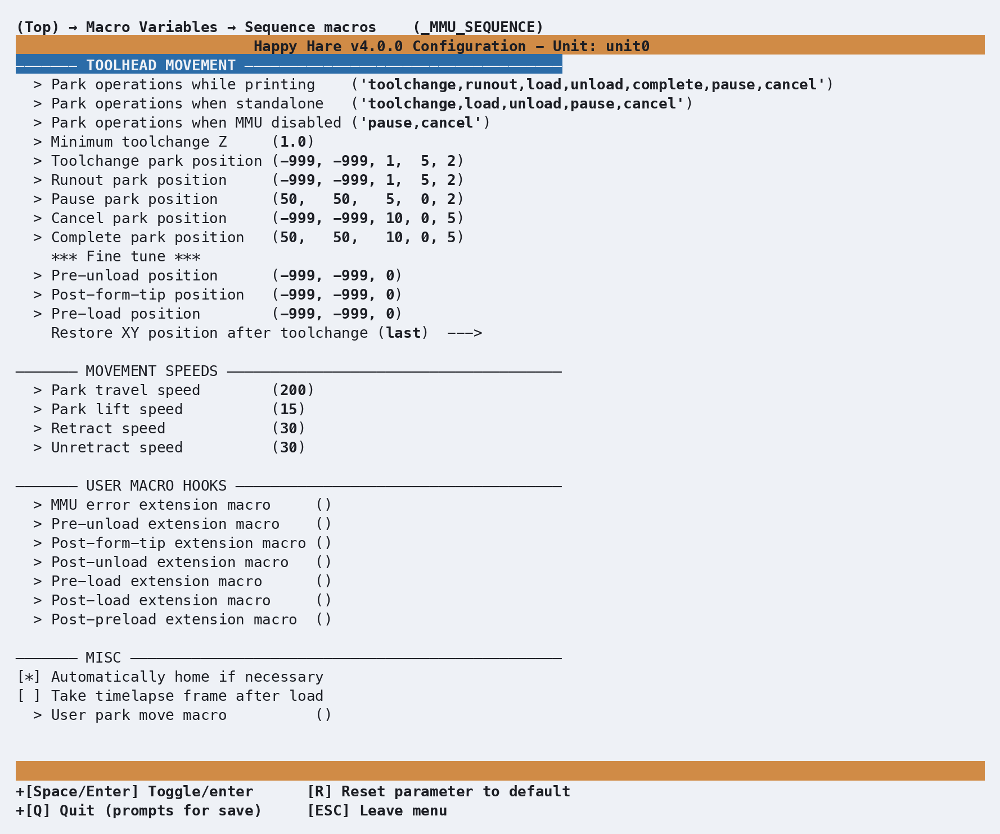

# Macro: Sequence

## What it does

Two distinct things live in this one macro block: toolhead parking (where
the toolhead moves during a toolchange, runout, pause, cancel, or completed
print) and a set of extension hooks that fire at fixed points around every
load and unload. [Toolchange Movement](Toolchange-Movement.md) already
covers parking in full - worked examples, diagrams, the park-position
tuples, `restore_xy_pos` - so this page doesn't repeat that. What it adds is
the menuconfig view of the same settings, plus the load/unload hooks that
page only mentions in passing.

## Where it's applied

Defined in `mmu_sequence.cfg`. Around every load/unload, five callback
macros fire in order - `_MMU_PRE_UNLOAD`, `_MMU_POST_FORM_TIP`,
`_MMU_POST_UNLOAD`, `_MMU_PRE_LOAD`, `_MMU_POST_LOAD` - each with a matching
`user_*_extension` hook, called after the default handling with the same
parameters. A sixth, `user_post_preload_extension`, fires after a
successful gate preload rather than a full load. See [Custom Load/Unload
Sequences](Custom-Load-Unload-Sequences.md) for how these fit around the
`_MMU_STEP_*` state machine itself.

## Configuration

  

`_MMU_SEQUENCE_VARS` in `mmu_macro_vars.cfg`, reachable from menuconfig's
**Macro Variables → Sequence macros (\_MMU_SEQUENCE)** screen shown above.
Full variable table: [Macro Variables:
Sequence/parking](Macro-Vars.md#sequenceparking-_mmu_sequence_vars). For the
parking/`restore_xy_pos`/z-hop settings shown on the same screen, see
[Toolchange Movement](Toolchange-Movement.md) instead - this page focuses on
what that one doesn't cover:

- **The six `user_*_extension` hooks** above - see [Macro
  Customization](Macro-Customization.md) for the extension mechanism they
  use, and `user_park_move_macro`, which *replaces* the default straight-line
  park move rather than extending it (called with `X=`/`Y=`/`F=`, and again
  with `RESTORE=1` when un-parking).
- **`auto_home`** (on by default) - home XYZ automatically if needed before
  a parking move, rather than erroring.
- **`timelapse`** (off by default) - take a timelapse frame after every
  load, if your setup has one configured.

## See also

- [Toolchange Movement](Toolchange-Movement.md) - parking positions,
  `restore_xy_pos`, z-hop, and worked configuration examples in full
- [Custom Load/Unload Sequences](Custom-Load-Unload-Sequences.md) - the
  deeper `_MMU_STEP_*` replacement mechanism this page's hooks sit in
  front of
- [Macro Customization](Macro-Customization.md) - the extension mechanism
  every `user_*_extension` hook here uses
- [Macro Variables: Sequence/parking](Macro-Vars.md#sequenceparking-_mmu_sequence_vars) -
  every `_MMU_SEQUENCE_VARS` setting in full

---
