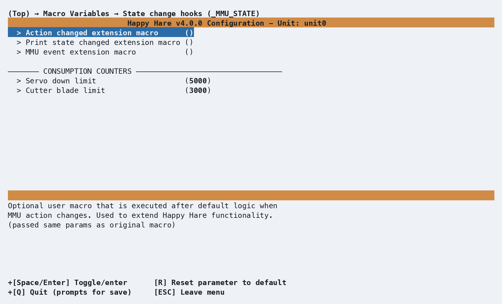

# Macro: State Change Hooks

## What it does

Extension points for the three macros Happy Hare calls whenever something
changes: the current action, the print state, or a one-off event. Almost
every other piece of automation on this site that reacts to "what the MMU
is doing right now" - LED effects, consumption counters - is itself built
on these three hooks, and your own extensions run alongside that default
behavior rather than replacing it.

## Where it's applied

All three are defined in `mmu_state.cfg` and fire automatically - nothing
calls them directly in normal use:

- **`_MMU_ACTION_CHANGED`** - runs whenever `printer.mmu.action` changes
  (`Idle`, `Loading`, `Unloading`, `Forming Tip`, `Selecting`, and so on -
  see [Printer Variables: Core state](Printer-Variables.md#core-state) for
  the full list). Receives `ACTION`/`OLD_ACTION`.
- **`_MMU_PRINT_STATE_CHANGED`** - runs whenever `printer.mmu.print_state`
  changes (`printing`, `paused`, `complete`, `error`, and so on - also on
  [Printer Variables: Core state](Printer-Variables.md#core-state)).
  Receives `STATE`/`OLD_STATE`.
- **`_MMU_EVENT`** - runs on one-off events that aren't really a state
  transition: `restart`, `gate_map_changed`, `servo_down`, `filament_cut`.
  Receives `EVENT` and event-specific parameters.

Your extension macro is called *after* the default handler, with exactly
the same parameters the original call received.

## Configuration

  

`_MMU_STATE_VARS` in `mmu_macro_vars.cfg`, reachable from menuconfig's
**Macro Variables → State change hooks (\_MMU_STATE)** screen shown above.
Full variable table: [Macro Variables: State change
hooks](Macro-Vars.md#state-change-hooks-_mmu_state_vars).

Two settings here aren't extension hooks at all - `servo_down_limit` and
`cutter_blade_limit` are maintenance-warning thresholds for a servo-cycle
and cutter-blade-use counter.

!!! note
    Neither limit drives a real counter on its own - nothing in Happy Hare
    increments a `servo_down`/`cutter_blade` counter automatically today.
    Wire one up yourself from the `_MMU_EVENT` hook above (it already fires
    a `servo_down` event) or from wherever your own macro operates a
    cutter, using
    [`MMU_STATS COUNTER=servo_down LIMIT={printer['gcode_macro _MMU_STATE_VARS'].servo_down_limit}`](Feature-Statistics-Counters.md#consumption-counters).

## See also

- [Macro Customization](Macro-Customization.md) - the extension mechanism
  these three hooks use
- [Macro Variables: State change hooks](Macro-Vars.md#state-change-hooks-_mmu_state_vars) -
  every `_MMU_STATE_VARS` setting in full
- [Printer Variables: Core state](Printer-Variables.md#core-state) - the
  `action`/`print_state` fields these macros report on
- [Feature: Statistics & Consumption Counters](Feature-Statistics-Counters.md#consumption-counters) -
  building a real counter from the limits above

---
