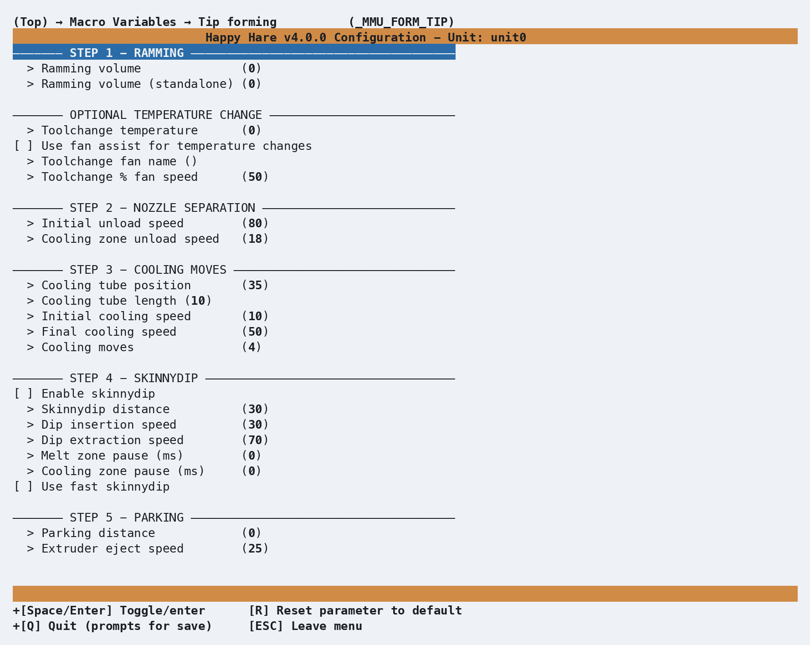

# Macro: Tip Forming

## What it does

Happy Hare's standalone filament-tip-forming macro - the default way to get
a clean, hair-free tip before an unload, working similarly to
PrusaSlicer/SuperSlicer's own tip forming. See [Feature: Tip Forming and
Purging](Feature-Tip-Forming-Purging.md) for the concept, the alternative
methods (toolhead cutting, slicer-controlled), and the full step-by-step
[tuning workflow](Feature-Tip-Forming-Purging.md#tuning-tip-forming) using
`MMU_TEST_FORM_TIP` - this page doesn't repeat that, just the menuconfig
view of the variables it tunes.

## Where it's applied

`_MMU_FORM_TIP`, defined in `mmu_form_tip.cfg`. Active whenever
`form_tip_macro: _MMU_FORM_TIP` in `mmu.cfg` (the default) - runs through
five steps in order: ramming, nozzle separation, cooling moves, an optional
skinnydip pass, then parking the result for eject/inspection or the next
unload step.

`Kconfig.form_tip` is sourced unconditionally in the installer, so this
screen is visible in menuconfig regardless of whether tip forming or
toolhead cutting is actually selected - unlike [Toolhead Tip
Cutting](Macro-Toolhead-Tip-Cutting.md)'s screen, which only appears once a
toolhead cutter is enabled.

Happy Hare zeroes pressure advance for the duration of the macro call, so
the ramming/cooling moves aren't distorted by it, then automatically
restores whatever value was active beforehand once tip forming completes -
nothing to configure or restore by hand.

## Configuration

  

`_MMU_FORM_TIP_VARS` in `mmu_macro_vars.cfg`, reachable from menuconfig's
**Macro Variables → Tip forming (\_MMU_FORM_TIP)** screen shown above,
grouped by the same five steps the tuning workflow walks through. Full
variable table: [Macro Variables: Tip
forming](Reference-Macro-Vars.md#tip-forming-_mmu_form_tip_vars).

### Hotend starting points

`cooling_tube_position`/`cooling_tube_length` are toolhead-specific -
tuning from scratch is slow, so start from your hotend's known geometry
rather than the shipped default:

| Hotend | `cooling_tube_position` | `cooling_tube_length` |
|---|---|---|
| DragonST | `35` mm | `15` mm |
| DragonHF | `30` mm | `10` mm |
| Mosquito | `30` mm | `20` mm |
| Revo | `35` mm | `10` mm |
| RapidoHF | `27` mm | `10` mm |

## See also

- [Feature: Tip Forming and Purging](Feature-Tip-Forming-Purging.md#tuning-tip-forming) -
  concept and the full `MMU_TEST_FORM_TIP` tuning workflow
- [Macro Variables: Tip forming](Reference-Macro-Vars.md#tip-forming-_mmu_form_tip_vars) -
  every `_MMU_FORM_TIP_VARS` setting in full
- [Macro: Toolhead Tip Cutting](Macro-Toolhead-Tip-Cutting.md) - the
  alternative that skips tip forming entirely
- [Macro Customization](Macro-Customization.md) - `form_tip_macro`, the
  replacement point that chooses between this macro and its alternatives

---
