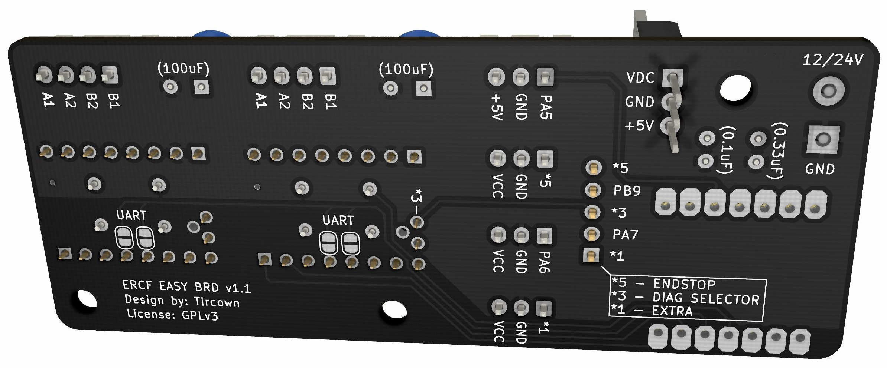
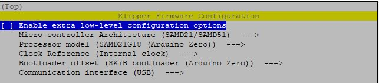
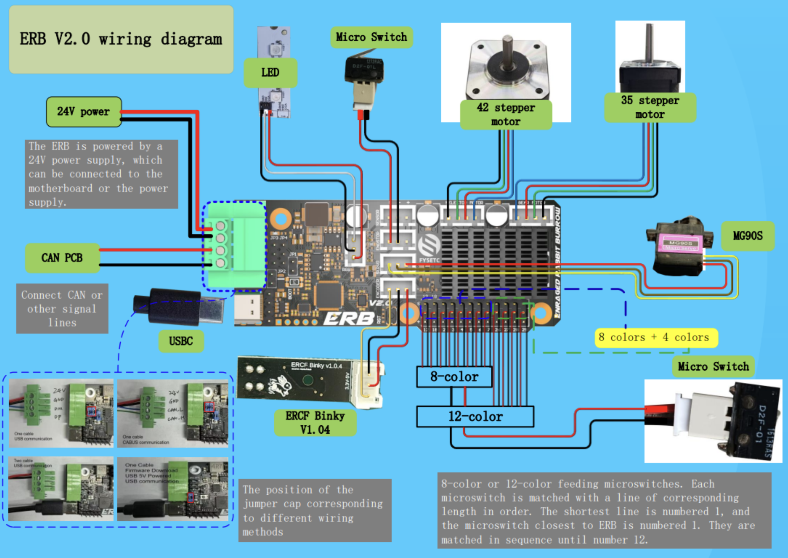
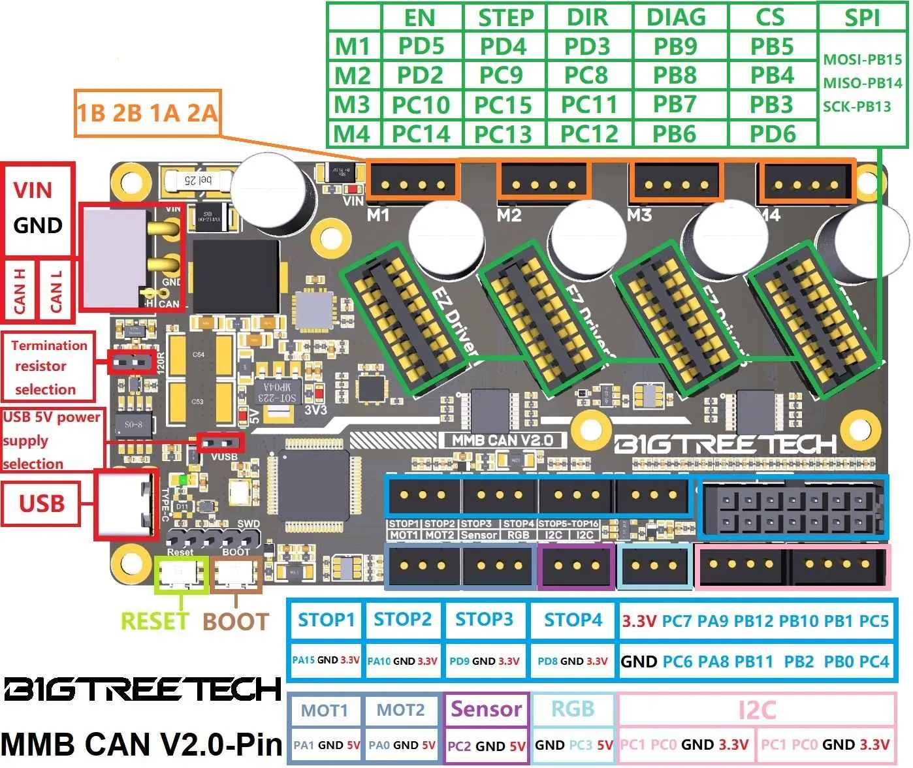
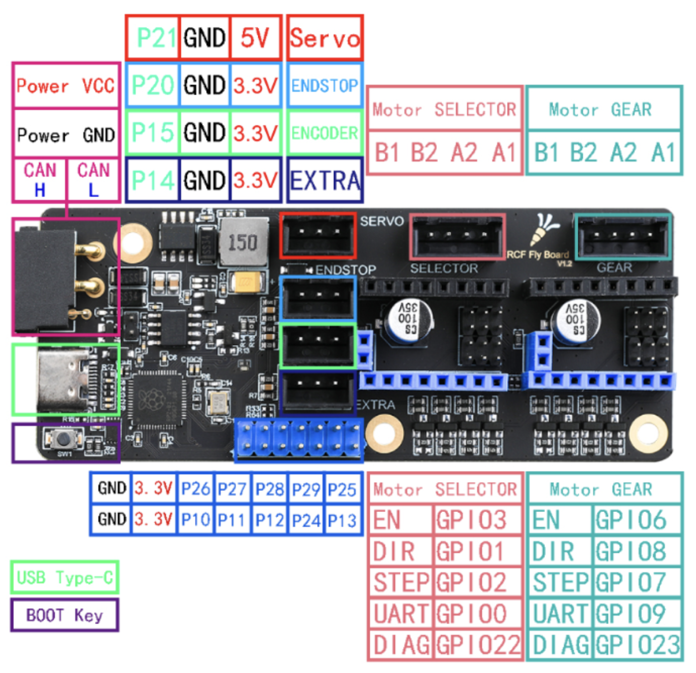

# MCU Reference

Reference material for the MCU/control boards Happy Hare's installer knows
about - pinouts, connection diagrams, and firmware-flashing notes for the
ones with images available, plus the complete current list of every board
`menuconfig`'s **Board type** screen offers. Picking one there sets up the
default pin layout for your setup automatically; pins can still be
customized afterward in Advanced Settings if needed. See
[Getting Started with Box Turtle](GettingStarted-BoxTurtle.md#board-type)
for what that screen actually looks like.

## Popular MCUs

### Standard EASY-BRD (SAMD21)

  

  
Firmware flashing

  

See [Flashing Firmware](#flashing-firmware) below for the full procedure.

### Fysetc Burrows ERB v2

  

Connection diagram:

  

  
Firmware flashing

  

See [Flashing Firmware](#flashing-firmware) below for the full procedure.

### BTT MMB CAN v1.0

  

!!! note
    CANbus firmware flashing is different enough from a plain USB/serial
    MCU that it's worth its own guide rather than the generic steps below -
    [Esoterical's BTT MMB CAN V1.0 flashing guide](https://canbus.esoterical.online/toolhead_flashing/common_hardware/BigTreeTech%20MMB%20CAN%20V1.0/README.html)
    is a solid one.

### BTT MMB CAN v2.0

  

!!! note
    See [Esoterical's BTT MMB CAN V2.0 flashing guide](https://canbus.esoterical.online/toolhead_flashing/common_hardware/BigTreeTech%20MMB%20CAN%20V2.0/README.html)
    for CANbus-specific flashing steps.

### Mellow EASY-BRD CAN v1

  

!!! note
    See [Esoterical's Mellow Fly ERCF flashing guide](https://canbus.esoterical.online/toolhead_flashing/common_hardware/Mellow%20Fly%20ERCF/README.html)
    for CANbus-specific flashing steps.

### Mellow EASY-BRD CAN v2

  

!!! note
    See [Esoterical's Mellow Fly SB2040 flashing guide](https://canbus.esoterical.online/toolhead_flashing/common_hardware/Mellow%20Fly%20SB2040/README.html)
    for CANbus-specific flashing steps.

## All Supported Boards

Every board `menuconfig`'s **Board type** screen offers, direct from the
installer's own Kconfig source - not just the ones with a pinout image
above. Most MMU types choose from the general list; per-gate MCU designs
(EMU) get their own list instead, and two MMU types (Box Turtle/KMS and BTT
ViViD) have a single fixed board rather than a choice at all.

### General boards

Offered for any MMU type except a per-gate MCU design, Box Turtle/KMS, or
BTT ViViD:

| Board | Pinout above? |
|---|---|
| Standard EASY-BRD with SAMD21 | ✅ |
| EASY-BRD with RP2040 | |
| Fysetc Burrows ERB v1 | |
| Fysetc Burrows ERB v2 | ✅ |
| BTT MMB v1.0 with CANbus | ✅ |
| BTT MMB v1.1 with CANbus | |
| BTT MMB v2.0 with CANbus | ✅ |
| BTT EBB 42 CANbus V1.2 | |
| BTT SKR Pico v1.0 | |
| Mellow EASY-BRD v1.x with CANbus | ✅ |
| Mellow EASY-BRD v2.x with CANbus | ✅ |
| AFC Pro v1.0 / designed for Box Turtle | |
| AFC Lite v1.0 / designed for Box Turtle | |
| WGB v3.0 / designed for Box Turtle | |
| TZB v1.0 / designed for ERCF | |
| Chameleon X5 v1 / designed for Quatrobox v2 | |
| *Not listed / Other* | — (generic fallback, no fixed pinout) |

### Per-gate boards (EMU multi-MCU designs)

A per-gate MCU setup (`--emu`/`-e` on the installer, see
[Installation](Installation.md#running-the-installer)) picks one of these
per gate instead of a single board for the whole unit:

| Board | Pinout above? |
|---|---|
| EBB MCU | |
| SLB MCU | |

### Fixed boards

These two MMU types skip the board-choice screen entirely - the board is
part of the design:

| MMU type | Fixed board | Pinout above? |
|---|---|---|
| Box Turtle/KMS | BIQU KMS MCU | |
| BTT ViViD | BTT ViViD MCU | |

See [Getting Started with BTT ViViD](GettingStarted-ViViD.md) for that
design's own MCU connection walkthrough.

## Flashing Firmware

Klipper firmware needs flashing to the MCU before it'll talk to Klipper at
all:

1. SSH into your Raspberry Pi.
2. Open a shell there and run:

        :::bash
        cd ~/klipper
        make menuconfig

3. Configure your board's firmware settings (chip, bootloader, communication
   interface) - specific to the MCU chip on your board, not something this
   page can give one universal answer for.
4. Save and exit (`Q`).
5. Then flash it:

        :::bash
        make flash FLASH_DEVICE=/dev/serial/by-id/<your-mcu-id>

!!! warning "Important"
    CANbus boards flash differently - follow
    [Esoterical's CANbus flashing guide](https://canbus.esoterical.online/toolhead_flashing.html)
    instead of the steps above.

!!! tip
    Not sure of your serial device path? Open a second SSH session, run `ls
    /dev/serial/by-id`, unplug the board, run it again, and see which line
    disappeared - that's the one that was yours.

## See also

- [Getting Started with Box Turtle](GettingStarted-BoxTurtle.md#board-type)
- [Getting Started with BTT ViViD](GettingStarted-ViViD.md)
- [Installation](Installation.md)

---
