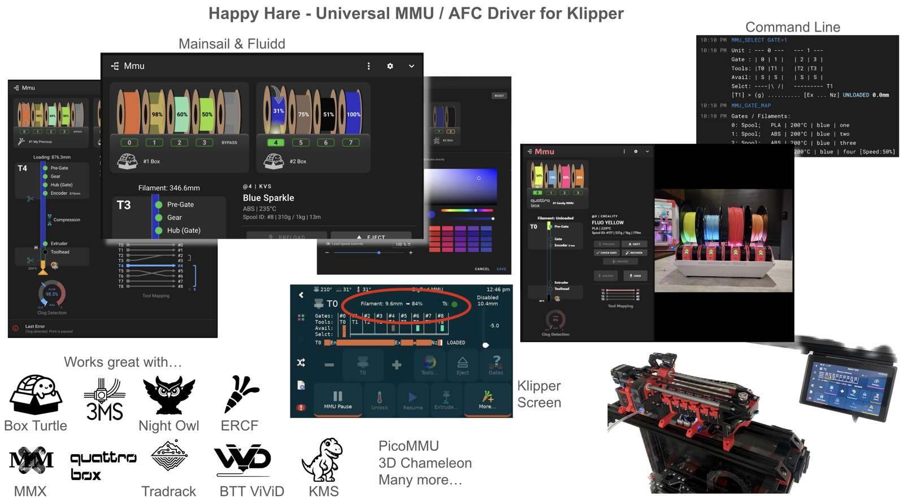

# Happy Hare

<em>Universal Automated Filament Changer / MMU driver for Klipper</em>

Happy Hare is the original open-source filament changer controller for multi-color
printing. Its philosophy is to provide a universal control system that adapts to
your choice of MMU (Multi-Material Unit): switch hardware and the software
transitions seamlessly with you.

It's implemented as a Klipper extension, driving the hardware directly and
exposing everything else through ordinary Klipper macros - if you can write a
`gcode_macro`, you can customize how Happy Hare behaves. If it helps to think of
it in web-browser terms: Klipper is the browser, and Happy Hare is an extension
that adds a whole new capability, without changing anything about how Klipper
itself works underneath.

Now in it's 4th generation it supports every MMU/AFC with rich integration to
Klipper, Mainsail, Fluidd, Klipperscreen and other ecosystems. It is super
flexible and now even easier to install and setup.

  

## What it drives

Happy Hare doesn't assume one piece of hardware - it supports most of the
MMU/AFC designs the community has built, from the original ERCF through
gear-per-gate designs like Box Turtle to fully custom builds, and it's actively
gaining more. See [What Is an MMU?](Conceptual-MMU.md) for how those designs
differ and which family yours falls into - that page is the real reference for
supported hardware, so this one won't repeat it.

Pair it with [KlipperScreen for Happy Hare](https://github.com/moggieuk/KlipperScreen-Happy-Hare-Edition)
for dedicated touchscreen control, or drive everything from the Happy Hare
panel that ships with Mainsail and Fluidd - both are shown above.

## What it does

A short list of what's actually in Happy Hare - most of these are their own
Feature page once you're ready for the detail:

- [Tool-to-gate mapping](Feature-Gate-TTG-Maps.md), so any physical spool
  can be assigned to any tool
- [EndlessSpool & runout detection](Feature-Endless-Spool-Runout.md) - a
  depleted gate hands off to a spare automatically, mid-print
- [Spoolman integration](Feature-Spoolman.md) for tracking usage, weight and
  attributes across a whole spool collection
- [NFC/RFID reading](Feature-NFC.md) so gates identify their spool by tag
  instead of by hand
- [Encoder-based](Feature-Encoder.md) movement validation, clog detection and
  flow-rate verification
- [Sync-feedback](Feature-Sync-Feedback-Buffer.md) control to keep the gear
  and extruder steppers working together instead of fighting each other
- [Motorized eSpooler](Feature-Espooler.md) support for active rewind and
  print-time assist
- [LED support](Feature-LEDs.md) for at-a-glance gate status
- A `menuconfig`-driven installer, so setup is a guided series of choices
  rather than hand-editing config files from scratch
- Moonraker update-manager integration, so it updates like any other Klipper
  plugin

  

## How this site is organized

The pages here are grouped by what you're trying to do, not by MMU brand:

- **Getting Started** walks through a real `menuconfig` install for one MMU
  type, screen by screen - the closest thing to "follow along and end up with
  a working setup."
- **Calibration** covers measuring the handful of dimensions that are
  physical to your specific build - selector position, gear rotation
  distance, encoder resolution, bowden length, toolhead geometry - and which
  of those actually apply to your MMU.
- **Concepts** covers terminology and hardware taxonomy that's shared across
  every MMU type - worth reading once, regardless of which hardware you have.
- **Features** has one page per capability (Spoolman, NFC, eSpooler, and so
  on) - dip into whichever ones you actually plan to use.
- **Macros** covers tuning and extending the gcode macros Happy Hare ships
  with - tip forming/cutting, parking, purging, pause/resume - one page per
  macro group, each with its own menuconfig screen.
- **Advanced Customization** covers replacing Happy Hare's own internal
  logic with your own macros - expert-level, and rarely needed.
- **Slicer & Toolchange** covers the slicer-side setup an MMU print needs,
  and how toolhead parking/movement works around a toolchange.
- **Operation** is day-to-day use once everything's configured - the
  console/UI commands you'll actually run, and what to do when a print
  pauses.
- **Tuning** is print-quality dialing-in once the basics work - toolhead
  dimensions, blobbing, and stringing.
- **Reference** is the flat lookup layer: every `MMU_*` command and
  `printer.mmu.*` variable generated straight from Happy Hare's source, plus
  every config and macro-tuning parameter documented from the real shipped
  templates.
- **Developer Guide** is for contributing to Happy Hare itself, not for
  running it - skip it unless you're reading or changing the code.

A few notational conventions carry across all of them: `MMU_LIKE_THIS` is a
gcode command, `like_this.cfg` is a config file, and `printer.mmu.like_this`
is a printer variable read from a macro or UI panel. A **warning** box means
something that can genuinely bite you if skipped; a plain **tip** is a
shortcut, not a requirement.

## Donations

Happy Hare is a labor of love, not a funded project - but it's a genuinely
large undertaking to maintain: tens of thousands of lines of driver and
installer code, thousands of lines of macros and config, a comparable amount
of documentation with hundreds of images and illustrations, and dedicated
integrations with KlipperScreen, Mainsail and Fluidd alongside it all.

If you've found value in Happy Hare and want to contribute, donations are
welcome via PayPal. Any support goes toward improving the experience for
whichever MMU/AFC you're running. Thank you!

  

## Getting help

Join the [Happy Hare Discord](https://discord.gg/aABQUjkZPk) - there are
channels dedicated to each MMU type as well as the main extensions. The
[GitHub issue tracker](https://github.com/moggieuk/Happy-Hare/issues) works
too, checked on a less immediate cadence.

Whichever you use, having these ready up front gets you a faster answer:

- `klippy.log` and `mmu.log`
- version info (`MMU_STATUS SHOWCONFIG=1` output)
- the exact error text
- what you were doing when it happened, and a picture if it's physical

!!! tip
    The easiest way to grab logs is through Mainsail: **Machine** tab →
    the dropdown at top → **Logs** → right-click the file you want → Download.

## Where to start

-   **Getting Started**

    ---

    New to Happy Hare? Walk through installing and configuring an MMU from
    scratch, `menuconfig` screen by screen.

    [Box Turtle guide &rarr;](GettingStarted-BoxTurtle.md)

-   **Calibration**

    ---

    Which calibration steps your MMU actually needs, what's mandatory versus
    safe to skip, and the order to run them in.

    [Calibration &rarr;](Calibration.md)

-   **Concepts**

    ---

    Terminology, selector mechanisms, and which vendors use which - read this
    once regardless of which MMU you have.

    [What Is an MMU? &rarr;](Conceptual-MMU.md)

-   **Features**

    ---

    One page per capability - Spoolman, NFC/RFID, eSpooler, encoder, and more.

    [eSpooler &rarr;](Feature-Espooler.md)

-   **Macros**

    ---

    Tuning and extending the gcode macros Happy Hare ships with - tip
    forming/cutting, parking, purging, pause/resume, and more.

    [Macro Customization &rarr;](Macro-Customization.md)

-   **Advanced Customization**

    ---

    Replacing Happy Hare's own load/unload logic with your own macros -
    expert-level, and rarely needed.

    [Custom Load/Unload Sequences &rarr;](Custom-Load-Unload-Sequences.md)

-   **Slicer & Toolchange**

    ---

    Setting up your slicer's start/end gcode, and how toolhead parking
    works around a toolchange.

    [Slicer Setup &rarr;](Slicer-Setup.md)

-   **Operation**

    ---

    Day-to-day commands, and what to do when the MMU pauses mid-print.

    [Operation &rarr;](Operation.md)

-   **Tuning**

    ---

    Dialing in toolhead dimensions and toolchange movement to eliminate
    blobbing and stringing.

    [Blobbing and Stringing &rarr;](Blobbing-and-Stringing.md)

-   **Reference**

    ---

    Every `MMU_*` command and `printer.mmu.*` variable, generated straight
    from the source.

    [Command Reference &rarr;](Reference-Commands.md)

-   **Developer Guide**

    ---

    Code layout and object ownership, the Kconfig/installer pipeline, and
    running Happy Hare - tested or interactively - with no printer attached.

    [Code Layout &rarr;](Dev-Code-Layout.md)

---

